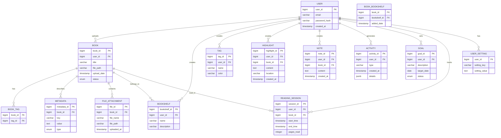

```mermaid
erDiagram
    %% ===== CORE ENTITIES =====
    USER ||--o{ BOOK : uploads
    USER ||--o{ BOOKSHELF : creates
    USER ||--o{ TAG : creates
    USER ||--o{ HIGHLIGHT : creates
    USER ||--o{ NOTE : creates
    USER ||--o{ ACTIVITY : generates
    USER ||--o{ GOAL : sets
    USER ||--o{ READING_SESSION : tracks
    USER ||--o{ USER_SETTING : has

    BOOK ||--o{ BOOK_TAG : has
    BOOK ||--o{ METADATA : describes
    BOOK ||--o{ FILE_ATTACHMENT : contains
    BOOK ||--o{ BOOKSHELF : belongs_to
    BOOK ||--o{ READING_SESSION : read_in
    
    %% ===== ENTITY STRUCTURES =====
    USER {
        bigint user_id PK
        varchar email
        varchar password_hash
        timestamp created_at
    }
    
    BOOK {
        bigint book_id PK
        bigint user_id FK
        varchar title
        varchar file_path
        timestamp upload_date
        enum status
    }
    
    BOOKSHELF {
        bigint bookshelf_id PK
        bigint user_id FK
        varchar name
        varchar description
    }
    
    TAG {
        bigint tag_id PK
        bigint user_id FK
        varchar name
        varchar color
    }
    
    HIGHLIGHT {
        bigint highlight_id PK
        bigint user_id FK
        bigint book_id FK
        text content
        varchar location
        timestamp created_at
    }
    
    NOTE {
        bigint note_id PK
        bigint user_id FK
        bigint book_id FK
        text content
        timestamp created_at
    }

    %% ===== RELATIONSHIP ENTITIES =====
    BOOK_TAG {
        bigint book_id FK
        bigint tag_id FK
    }
    
    BOOK_BOOKSHELF {
        bigint book_id FK
        bigint bookshelf_id FK
        timestamp added_date
    }

    %% ===== SUPPORTING ENTITIES =====
    METADATA {
        bigint metadata_id PK
        bigint book_id FK
        varchar key
        text value
        enum type
    }
    
    FILE_ATTACHMENT {
        bigint file_id PK
        bigint book_id FK
        varchar file_name
        varchar file_path
        timestamp uploaded_at
    }
    
    READING_SESSION {
        bigint session_id PK
        bigint user_id FK
        bigint book_id FK
        timestamp start_time
        timestamp end_time
        integer pages_read
    }
    
    ACTIVITY {
        bigint activity_id PK
        bigint user_id FK
        varchar type
        timestamp created_at
        jsonb details
    }
    
    GOAL {
        bigint goal_id PK
        bigint user_id FK
        varchar description
        date target_date
        enum status
    }
    
    USER_SETTING {
        bigint user_id FK
        varchar setting_key
        text setting_value
    }
```
