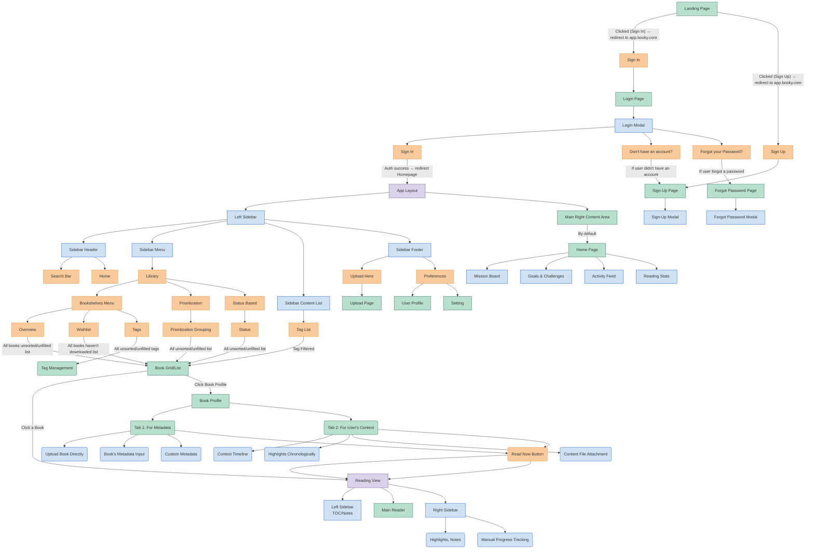

```mermaid
graph TD
    %% ===== CSS & GLOSSARY =====
    classDef layout fill:#d9d2e9,stroke:#674ea7;
	classDef page fill:#b7e1cd,stroke:#2d6659;
	classDef component fill:#cfe2f3,stroke:#1155cc;
	classDef navigate fill:#f9cb9c,stroke:#e69138;

	%% ===== LANDING PAGE =====
	LANDING_PAGE[Landing Page]:::page --->|"Clicked (Sign In) → redirect to app.booky.com"| SIGN_IN[Sign In]:::navigate --> LOGIN_PAGE[Login Page]:::page
	LANDING_PAGE[Landing Page]:::page --->|"Clicked (Sign Up) → redirect to app.booky.com"| SIGN_UP[Sign Up]:::navigate --> SIGNUP_PAGE

    %% ===== LOGIN & ONBOARDING =====
    LOGIN_PAGE 
    LOGIN_PAGE --> LOGIN_COMPONENT[Login Modal]:::component
    LOGIN_COMPONENT --> LOGIN_BUTTON[Sign In]:::navigate -->|"Auth success → redirect Homepage"| APP_LAYOUT
    LOGIN_COMPONENT --> SIGN_UP_BUTTON[Don't have an account?]:::navigate -->|If user didn't have an account| SIGNUP_PAGE[Sign-Up Page]:::page --> SIGNUP_COMPONENT[Sign-Up Modal]:::component
    LOGIN_COMPONENT --> FORGOT_PASSWORD_BUTTON[Forgot your Password?]:::navigate -->|If user forgot a password| FP_PAGE[Forgot Password Page]:::page --> FP_COMPONENT[Forgot Password Modal]:::component

    %% ===== APP LAYOUT =====
    APP_LAYOUT[App Layout]:::layout
    APP_LAYOUT --> SIDEBAR[Left Sidebar]:::component
    APP_LAYOUT --> CONTENT[Main Right Content Area]:::page
    READER[Reading View]:::layout

    %% ===== CONTENT AREA =====
    CONTENT -->|"By default"| HOME[Home Page]:::page

    %% === Home Page Components ===
    HOME --> MISSION[Mission Board]:::component
    HOME --> GOALS[Goals & Challenges]:::component
    HOME --> ACTIVITY[Activity Feed]:::component
    HOME --> STATS[Reading Stats]:::component

    %% === Library Flow ===
    LIBRARY[Book Grid/List]:::page -->|"Click a Book"| READER
    LIBRARY[Book Grid/List]:::page -->|"Click Book Profile"| BOOK_PROFILE[Book Profile]:::page

    %% === Sidebar Navigation ===
	SIDEBAR --> SIDEBAR_HEADER[Sidebar Header]:::component
	SIDEBAR --> SIDEBAR_MENU[Sidebar Menu]:::component
	SIDEBAR --> SIDEBAR_CONTENT[Sidebar Content List]:::component
	SIDEBAR --> SIDEBAR_FOOTER[Sidebar Footer]:::component

    SIDEBAR_HEADER --> SEARCH[Search Bar]:::navigate
    SIDEBAR_HEADER --> HOME_LINK[Home]:::navigate
    
    SIDEBAR_MENU --> LIB_LINK[Library]:::navigate 
    
    SIDEBAR_CONTENT --> TAGS[Tag List]:::navigate -->|Tag Filtered| LIBRARY
    
    SIDEBAR_FOOTER --> BULK_UPLOAD[Upload Here]:::navigate
    SIDEBAR_FOOTER --> PREFERENCES[Preferences]:::navigate

	%% ===== Library Navigation =====
	LIB_LINK --> BOOKSHELVES[Bookshelves Menu]:::navigate
	LIB_LINK --> PRIORITIZATION[Prioritization]:::navigate 
	LIB_LINK --> STATUS/LIST[Status Based]:::navigate 

	BOOKSHELVES --> OVERVIEW[Overview]:::navigate -->|All books unsorted/unfilted list| LIBRARY
	BOOKSHELVES --> WISHLIST[Wishlist]:::navigate -->|All books haven't downloaded list| LIBRARY
	BOOKSHELVES --> TAGS_TAXONOMY[Tags]:::navigate -->|All unsorted/unfilted tags| TAGS_MANAGEMENT(Tag Management):::page

	PRIORITIZATION --> GROUPING[Prioritization Grouping]:::navigate -->|All unsorted/unfilted list| LIBRARY

	STATUS/LIST --> STATUS_FILTERED[Status]:::navigate -->|All unsorted/unfilted list| LIBRARY

	%% ===== Book Profile =====
	BOOK_PROFILE --> TAB1(Tab 1: For Metadata):::page
	BOOK_PROFILE --> TAB2(Tab 2: For User's Context):::page
	
	%% ===== Book Profile Tab 1 =====
	TAB1 --> SINGLE_UPLOARD(Upload Book Directly):::component
	TAB1 --> DEFAULT_METADATA(Book's Metadata Input):::component
	TAB1 --> CUSTOM_METADATA(Custom Metadata):::component

	%% ===== Book Profile Tab 2 =====
	TAB2 --> CONTEXT_TIMELINE(Context Timeline):::component
	TAB2 --> HIGHLIGHT(Highlights Chronologically):::component
	TAB2 --> FILE_ATTACHMENT(Content File Attachment):::component

	TAB1 --> READ_NOW(Read Now Button):::navigate --> READER
	TAB2 --> READ_NOW --> READER

    %% === Upload ===
	BULK_UPLOAD --> UPLOAD_PAGE[Upload Page]:::page

	%% === Preferences ===
    PREFERENCES --> USER_PROFILE[User Profile]:::page
    PREFERENCES --> SETTING[Setting]:::page

    %% === Reader Page Structure ===
    READER --> READER_LEFT[Left Sidebar<br>TOC/Notes]:::component
    READER --> READER_MAIN[Main Reader]:::page
    READER --> READER_RIGHT[Right Sidebar]:::component

	%%% === Reader Right Sidebar ===
	READER_RIGHT --> TAB1_READER(Highlights, Notes):::component
	READER_RIGHT --> TAB2_READER(Manual Progress Tracking):::component
```
