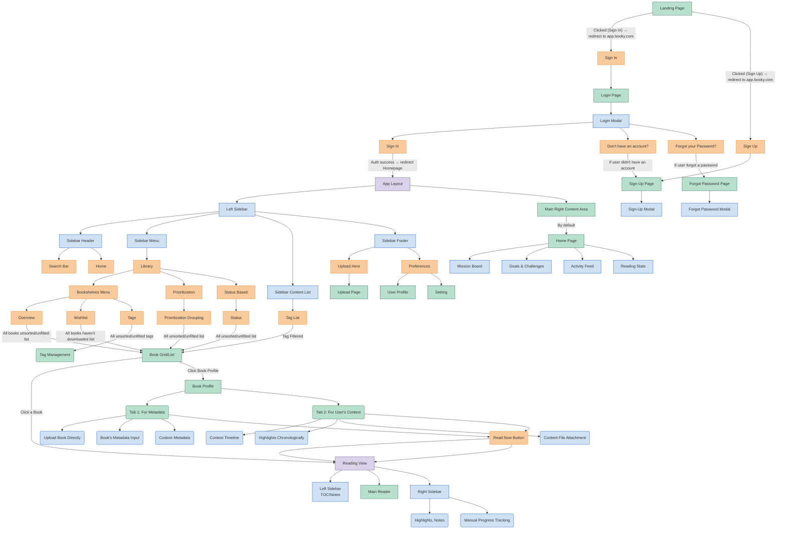

- **Booky**: 
	- An ideal reading management app. Ideated through synthesizing your [[Pain Request|pain points and desired features]].
- **Abstract**
	- **Purpose**: 
		- Unified Reading & Knowledge Management Platform.
	- **Vision**: 
		- A holistic app for managing eBooks, highlights, reading progress, and prioritization — optimized for users who value deep focus, local file management, and integration with Obsidian. 
---
- **1. Target User & Core Problems**  
	- **User Profile**  
		- Avid reader with a large personal eBook library (1,300+ files).  
		- Uses Obsidian for knowledge management; wants seamless export.  
		- Values prioritization, analytics, and organization over social features.  
		- Frustrated by fragmented tools (Readwise, StoryGraph, Goodreads). 
		- Subscribed to Obsidian philosophy of "Local-First", handle everything locally.
		- Mainly uses services like z.lib.io to download books.
		- Loves to read intentionally, gather/collect sources of books as information gathering, and references.
- **Key Pain Points**  
	1. **Unmanageable Local Libraries**:  
		1. No unified way to track which books are uploaded/available vs. wishlisted.  
		2. Lack of metadata control for local files (EPUB/PDF).  
	2. **Poor Prioritization**:  
		1. Cannot weight recommendations by source credibility (e.g., Nassim Taleb > YouTube comment).  
		2. No progress tracking across tags/categories (e.g., "Learning" shelf at 50% completion).  
	3. **Fragmented Workflow**:  
		1. Readwise Reader lacks analytics and progress tracking.  
		2. StoryGraph lacks local file support and prioritization.  
---
- **2. User Experience (UX)**
	- **A. User Journey Flow**
		- **Login & Onboarding**
			- **Landing Page:** Above-the-fold, showcasing features, FAQ. User click to login. Using main domain, and static.
			- **Login Page**: Minimalist design with privacy-first messaging ("Your library stays yours"). Using app.maindomain.com
			- **First-Time Setup**: 
			    - Product onboarding: User data tracking, let the user know about our "Feature Request" platform.
			    - Guided tour of key sections: Home, Search, Library, Reader.
		- **Main Dashboard**
		    - **Home**: Dashboard with analytics and goals.
		        - Personalization:
		            - _Mission Board_: User-defined focus areas (e.g., "Master Stoicism 2024") with linked books. Refer to [[Mission Board]] 
		            - _Goals & Challenges_: "Complete 50% of 'Learning' shelf by December." Refer to [[Challenge]].
		        - Activity Feed:
		            - _Recent_: Showcase recent books open. Recent highlights, annotations, and book completions (no social sharing).
		            - _Current Read_: Progress bar (Tag progress bar, book progress bar, goal progress bar) + time spent.
		            - _Favorite/Star_: User tagged favorite.
		        - Stats:
		            - _Reading Trends_: Pages/day, genre distribution. Refer to [[Stats]].
- **B. Interface & Interactions**
	- **1. Navigation**
		- **Sidebar**: Refer to [[Layout]]
		    - Sidebar Header:
		        - **Search**: Advanced content discovery.
		        - **Home**: Dashboard with stats/goals.
		    - Sidebar Menu:
		        - **Library**: Full collection management
		            - Bookshelves:
		                - Overview: User can see the whole library unfiltered/unsorted.
		                - Wishlist: 
		                    - A page where user can see a list filled with all books. This is for user to manage their reading plan. User can see the whole library (that haven't downloaded, meaning user input this book, but this book not yet available to read in database (user haven't upload the book file))
		                    - Add books easily with rich context ("Recommended by Nassim Taleb in _The Black Swan_").
		                - Tags: User can manage tags here
		            - Prioritization
		                - Grouping of Prioritization based of User's setting.
		            - Status
		                - 
		    - Sidebar Content List:
		        - List out all Tags below here. So user can can click at Tag and see a list of books based of that tags.
		    - Sidebar Footer (Setting/Utilities):
		        - Bulk Upload -> Open up to a page where user can manage their bulk upload
		        - Settings and User Profile:
	- **2. Search Engine**
		- **Unified Search**:
		    - Query titles/authors/highlights/annotations.
		    - **Filters**:
		        - Availability (Uploaded/Local/Wishlist)
		        - Progress (Unread/In Progress/Completed)
		        - Priority Score (e.g., ">7/10")
		- **Results**:
		    - Grouped by books/highlights/notes.
		    - Highlight previews with context.
	- **3. Library**
		-  Book Grid/List
			- User can also click the book to open up "Book Profile"
		- **Tabs**:
		    - **Prioritization**: (Just a list, that based of recommendation weightage)
		        - Recommendation weight matrix (assign source credibility). Recommendation Matrix: Assign weights to sources (e.g., "Nassim Taleb = 10/10").
		        - AI-assisted ranking based on tags/goals. Scoring System: Manually adjust priority or let AI auto-rank based on tags/goals.
		        - Blank Slate Method templates ("Why Read This?").
		        - User can also click the book to open up "Book Profile"
		    - **Status/List**: 
		        - Based of Status.
		        - User can also click the book to open up "Book Profile"
		        - Grid/list view toggle with sort options (priority, progress, title).
		    - **Tags**: Nested taxonomy (`Nonfiction/Psychology`) with aggregate progress tracking.
		- **Book Profile (When User Click/Expand a Book)**: 
		    - Tab 1 (Profile and Rich Metadata):
		        - Upload: Uploading the book. Auto book image detected through the file.
		        - Book metadata fields (Type (EPUB, PDF, Kindle), Author, Published, Upload/Saved date, Length (i.e (3 hrs 41 mins (58,385 words)).) 
		        - Custom metadata fields (Recommendation Source, Linked Obsidian Notes, Tags, Blank Slate Statement).
		        - Status (Wish, Available to Read, In-Progress, Lapse, Finished, Note-taking Mode, Spaced Repetition)
		        - Priority scoring + external link attachments.
		    - Tab 2 (Notebook):
		        - Context Timeline (Added: Jan 5 | Highlighted: 10 quotes on March 2 | Last visit/read | Progress bar).
		        - All highlights appear here chronologically.
		        - Can add document notes.
		        - Content File attachments (PDF summaries, mind maps, links, etc). - So user can put anything to put more "context"
- **C. Reading Mode (Reader Experience)**
	- **Reading Tools**:
	    - Manual Progress Tracking:
	        - Slider to set page/chapter %.
	        - Checkpoints (e.g., "Mark Chapter 5 as complete").
	    - Color-coded highlights with nested tags (`#quote`, `#critical-concept`). Refer here [[Highlighting]]
	- **Nudges**: "Haven’t opened _Antifragile_ in 14 days - resurface?"

---
- **3. Core Features**
	- **A. Library Management**
		- **Problem**: Chaotic 1,300+ eBook collections across devices. and format
		- **Solution**:
			- Bulk EPUB/PDF upload with auto-tagging/duplicate detection. Built for people who loves to own the PDF of the book, instead of relying on reading platform like Kindle etc.
			- Detect duplicates.
			- Book Profile: Created a function called Book Profile where user can plan their reading despite of not having the book yet. Book profile allow metadata editor for titles/authors/custom fields. Also user's context for prioritization.
	- **B. Prioritization Engine**
		- **Problem**: Can’t weight recommendations or track category progress.  
		- **Solution**:
			- **Weighted Recommendations**:
			    - Assign priority scores to recommendation sources (e.g., Nassim Taleb = 10/10, YouTube comment = 2/10).
			    - AI-driven "Grouping" based on priority/thematic relevance/time available.
		- **Progress Aggregation**:
		    - Track completion % per tag/category (e.g., "Learning" = 50% if 5/10 books are half-read).
		    - Dashboard with progress bars for tags, authors, or custom lists.
	- **C. Integrated Reader**
		- **Problem**: Readwise Reader lacks analytics.  
		- **Solution**:
			- Highlight/annotation sync + nested tagging (`Nonfiction/Psychology/Biases`).
			- **Advanced Filters**: Sort by priority score, progress %, or time since last opened.
	- **D. Obsidian Integration** (External Plugin, built in Obsidian)
		- **Problem**: Disconnected note-taking workflow.  
		- **Solution**:
			- **Bidirectional Sync**:
			    - Auto-export highlights/progress to Obsidian with YAML front matter. User can customize their Obsidian CSS, so the export can be "custom".
			    - Pull Obsidian notes into Book Profiles.
			- **Plugin Workflow**:
			    1. User opens Obsidian and activates the plugin.
			    2. OAuth login via Obsidian.
			    3. Sync Options:
				    - Pull highlights, annotations, and progress %.
				    - Push Obsidian notes to the app’s "Book Profile" (bidirectional linking).
			    4. Preview rendered Markdown templates.
	- **E. Reader Analytics**
		- Problem: Hard to track progress without proper analytics
		- Solution:
			- Time spent per book/session.
			- Highlight density (e.g., "You highlighted 15% of this book").
			- Exportable charts for yearly/monthly trends.

