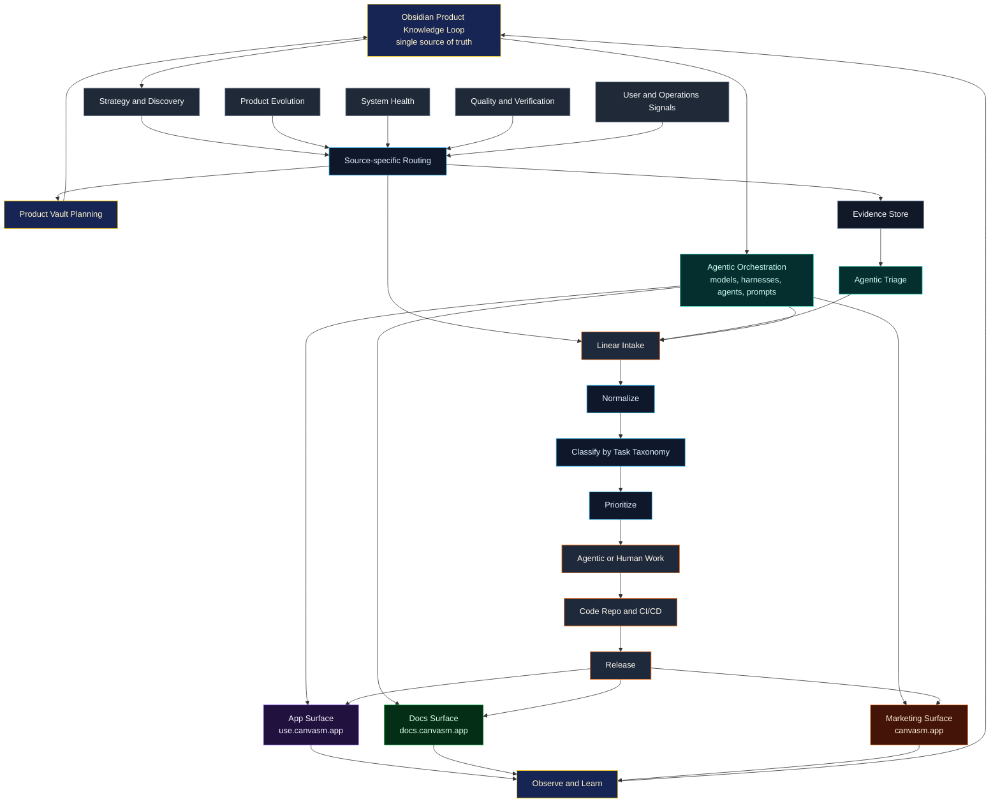

# Development Operating System

This note defines the operating system for building software without losing the product thinking, user signals, bugs, test findings, and lessons discovered along the way.

The goal is not just to manage tasks. The goal is to create a product learning loop where every useful signal can become better product judgment, better execution, and better future decisions.

## Why this lives here

This belongs under `3. Operation` because it is a reusable development workflow across products, not only a single app document.

Product-specific notes can link back here from their own product folders, such as Builddd.ai, Dealn, Canvasm, or any future application. The general operating system should stay here. The practical implementation details for one product can live inside that product's own folder.

When using Claude Code, the product-specific Obsidian folder can be granted as an additional directory so the agent can read and write the product learning loop directly. This makes the product vault the agent-accessible knowledge base while keeping source code and implementation artifacts in the repo.

The Obsidian knowledge loop is also what makes agentic orchestration possible across surfaces. The app, docs, and marketing site should not each recreate product understanding from scratch. They should all draw from the same product source of truth, then feed new evidence and learning back into it.

## Core loop



## One source of truth per layer

| Layer | Tool | Source of truth for |
|---|---|---|
| Work | Linear | Tasks, status, priority, ownership, delivery state |
| Knowledge | Obsidian | Decisions, insights, principles, learning, product memory |
| Execution | Agents and humans | Implementation, investigation, review, handoff |
| Code | Repo | Actual product changes + infrastructure/structural technical docs only (product docs live in Obsidian) |
| Quality | CI/CD + manual-test sub-issues (Manual Test project) | Proof that the work builds, passes, and a human vetted it |
| Learning | Obsidian and metrics | What changed our understanding |

## Multi-surface product system

One product can have multiple delivery surfaces:

| Surface | Example domain | Primary job |
|---|---|---|
| App | `use.canvasm.app` | Product experience and user workflows |
| Docs | `docs.canvasm.app` | User education, help, reference, onboarding support |
| Marketing | `canvasm.app` | Positioning, trust, conversion, narrative |

These surfaces should be managed from the same product knowledge loop. The app agent, docs agent, and marketing agent may produce different artifacts, but they should share the same source of truth:

- product principles
- positioning
- feature behavior
- known limitations
- user jobs
- terminology
- QA learnings
- support insights
- release context
- decisions and tradeoffs

This prevents each agent from inventing its own version of the product.

## Agentic orchestration layer

Models, harnesses, prompts, MCP servers, Claude Code skills, evals, and workflow agents sit on top of the Obsidian product knowledge loop.

Their job is to translate the source of truth into work across surfaces:

- app implementation
- docs writing and updates
- marketing copy and landing page changes
- QA generation
- support playbooks
- Linear triage
- release notes
- postmortems

The orchestration layer should both consume and update the product vault. If a docs-writing agent discovers a clearer explanation, or an app-building agent discovers a product constraint, that learning should feed back into Obsidian.

## Product vault as agent knowledge base

Each product should have a product-specific Obsidian folder that acts as its knowledge base.

Example:

```text
5. Idea Vault/Application/B2B/Active/Canvasm - Easy Workflow
```

Claude Code can be launched from the repo with access to that product vault. The repo tells the agent where the knowledge lives; the product vault stores product memory, decisions, build logs, QA learnings, postmortems, and durable insights.

See [[3.b Claude Code Obsidian Knowledge Setup]].

## Related notes

- [[2.a Task Sources and Intake Groups]]
  - [[2.a.i Strategy and Discovery Pipeline]]
  - [[2.a.ii Product Evolution Pipeline]]
  - [[2.a.iii System Health Pipeline]]
  - [[2.a.iv Quality and Verification Pipeline]]
  - [[2.a.v User and Operations Signals Pipeline]]
- [[2.b Task Normalization and Taxonomy]]
- [[2.c Agentic Triage Automation and Source Routing]]
- [[3.a Workflow Architecture - Linear Obsidian Agents Product Surfaces CI-CD]]
- [[3.b Claude Code Obsidian Knowledge Setup]]
- [[3.c Obsidian Learning Loop]]
- [[4.a System Health Task Intake Prompt]]
- [[5. Implementation Roadmap]]

## Reading order

| Order | Note | Role |
|---|---|---|
| 1 | [[1. Development Operating System]] | Hub and mental model |
| 2.a | [[2.a Task Sources and Intake Groups]] | Where signals come from and how they route |
| 2.a.i–v | Per-group pipelines ([[2.a.i Strategy and Discovery Pipeline\|Strategy]], [[2.a.ii Product Evolution Pipeline\|Evolution]], [[2.a.iii System Health Pipeline\|System Health]], [[2.a.iv Quality and Verification Pipeline\|Quality]], [[2.a.v User and Operations Signals Pipeline\|User/Ops]]) | Pipeline, checklist, tooling, and build backlog per group |
| 2.b | [[2.b Task Normalization and Taxonomy]] | How signals become comparable work |
| 2.c | [[2.c Agentic Triage Automation and Source Routing]] | How triage can be automated by source type |
| 3.a | [[3.a Workflow Architecture - Linear Obsidian Agents Product Surfaces CI-CD]] | How tools and product surfaces fit together |
| 3.b | [[3.b Claude Code Obsidian Knowledge Setup]] | How Claude Code uses product vaults |
| 3.c | [[3.c Obsidian Learning Loop]] | How learning is captured |
| 4.a | [[4.a System Health Task Intake Prompt]] | Concrete System Health implementation prompt |
| 5 | [[5. Implementation Roadmap]] | Rollout plan |

## Operating principles

1. Linear tracks work. Obsidian stores learning.
2. A raw signal is not automatically a task. It must pass through intake and normalization.
3. Bugs, feedback, analytics, QA findings, and experiments should all become comparable work items.
4. Product decisions should leave a memory trail, especially when they affect future direction.
5. Agentic work should start from clear context and end with verifiable output.
6. CI/CD is a gate, not a memory system.
7. Manual tests are Linear sub-issues in the Manual Test project (label manual-test), not compiled docs — a human vets each feature before Done, and failures spawn follow-up sub-issues.
8. The loop closes only when the lesson is captured and used to shape future work.
9. Agents should write durable product learning to the product vault, not scatter product memory through the repo.
10. Not every source should enter Linear immediately. Source-specific routing decides whether a signal belongs first in Linear, the evidence store, or product-vault planning.
11. App, docs, and marketing agents should share the same product vault so each surface stays coherent with the others.

## Practical split

Use Linear when the question is:

- What needs to be done?
- Who or what is doing it?
- What state is it in?
- What is blocking it?
- What is ready to ship?

Use Obsidian when the question is:

- What did we learn?
- Why did we decide this?
- What pattern keeps repeating?
- What should future agents or builders know?
- What principle should change because of this?

Use the product Obsidian vault with Claude Code when the question is:

- What context should the agent know before implementing?
- What did this implementation teach us about the product?
- What should the next agent remember?
- Which decision, QA checklist, build log, or postmortem should be updated?

Use the repo and CI/CD when the question is:

- What changed?
- Does it build?
- Does it pass tests?
- Is it safe to deploy?
- Can we trace the work back to its issue and reasoning?

## The important distinction

Tasks are temporary. Knowledge compounds.

The workflow should not turn Obsidian into another backlog. Obsidian should help future decisions become sharper because it remembers the reasoning, evidence, mistakes, and patterns behind the work.
