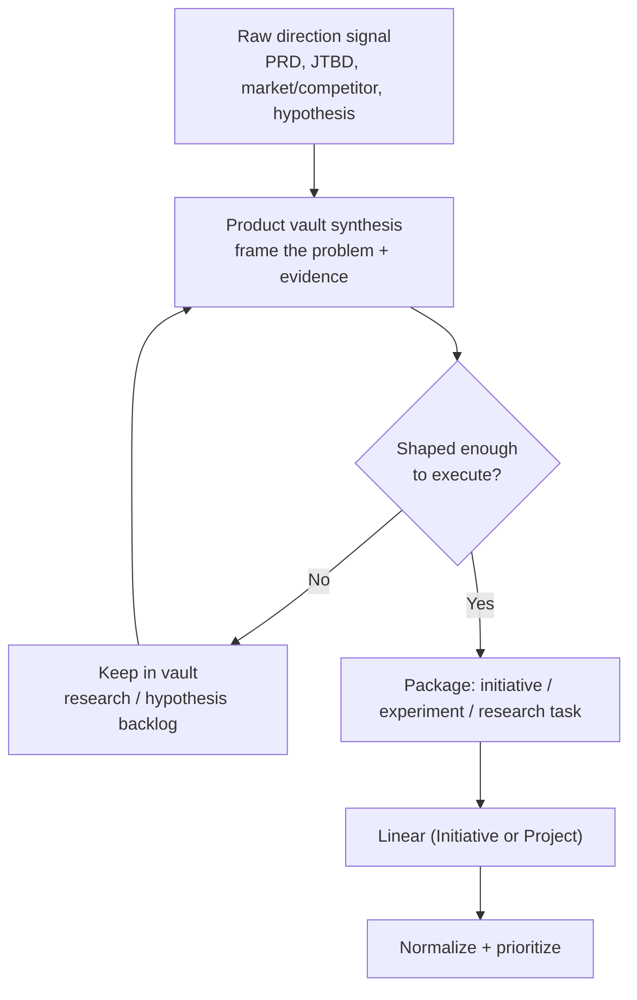

# Strategy and Discovery Pipeline

Per-group deep dive for **Group 1** in [[2.a Task Sources and Intake Groups]]. This note keeps `2.a` simple and elaborates the pipeline, checklist, tooling, current state, and build backlog for turning direction into executable work.

> **Principle for this group:** most signals here should **not** start as Linear tasks. They start as synthesis in the product vault and only enter Linear once there is a concrete initiative, experiment, research task, or scoped implementation package. Automation level: **low** — this is judgment work.

## Pipeline



## Intake checklist

Before a Strategy & Discovery item earns a Linear issue, it should carry:

- [ ] **Job / problem framed** — the underlying job-to-be-done, not a feature name
- [ ] **Evidence** — what makes us believe this matters (user, market, competitor, data)
- [ ] **Hypothesis** — "we believe X will produce Y, measured by Z"
- [ ] **Success metric** — the driver/metric this moves (link the metric tree)
- [ ] **Type decided** — initiative vs. experiment vs. research task vs. product principle
- [ ] **PRD link** — which PRD section this belongs to or amends
- [ ] **Non-goals** — what this explicitly is not

## Tactics and tooling

| Need | Tool / artifact |
|---|---|
| Source of direction | PRD in the product vault (`PRD/`) and repo `docs/prd/prd.md` |
| Methodology reference | metric-tree methodology — repo `docs/reference/metric-tree-methodology.md` (principle, not spec) |
| Discovery synthesis | Product vault planning notes; [[3.c Obsidian Learning Loop]] |
| Execution tracking | Linear **Initiatives** → **Projects** → issues (not loose issues) |
| Progress signal | Linear **Initiative updates** (on-track / at-risk / off-track) feeding the learning loop |
| Handoff to build | Shaped issue with acceptance criteria → [[2.b Task Normalization and Taxonomy]] |

## Linear Initiatives — the execution container

Linear **Initiatives** are the native home for "promote to Linear" in this group. An Initiative is a curated set of Projects with its own doc, owner, target date, resources, and a health rollup (on-track / at-risk / off-track). That maps 1:1 to how strategy should enter execution:

```text
vault synthesis → shape → Initiative (objective = metric-tree node)
                              → Projects (the bets/workstreams)
                                   → issues (the work)
```

- Set each Initiative's **objective to a metric-tree node**, so strategy stays tied to the value pipeline rather than floating as a theme.
- **Initiative updates** are the loop-back: at-risk/off-track signals become learning-note prompts in the vault ([[3.c Obsidian Learning Loop]]).
- Use **Projects views / labels** for automatic grouping that *isn't* a company objective; reserve Initiatives for real objectives worth tracking. Enable from Linear **Settings → Initiatives**.

## Current state (Canvasm)

- PRD lives in the vault (`PRD/`) and repo (`docs/prd/`); the north star and metric-tree methodology are documented.
- Direction is captured, but there is **no standing experiment or hypothesis register** — discovery reasoning is scattered rather than pooled.
- Linear is used for execution; initiatives are not yet the consistent entry point for strategy work.

## Build backlog

- [ ] **Enable Linear Initiatives** and stand up the first one per metric-tree objective (Projects hang under it)
- [ ] Create an **Initiative template** (problem, hypothesis, success metric, scope, non-goals) in `Templates/`
- [ ] Stand up a **Hypothesis / bet register** note in the product vault (one row per bet, status, evidence, outcome)
- [ ] Stand up an **Experiment log** (what we tried, metric, result, decision)
- [ ] Stand up a **Competitive / market learning log** feeding discovery
- [ ] Define the **"promote to Linear" rule** — the exact bar at which a vault idea becomes a Linear initiative/experiment/research task
- [ ] Link each initiative to the **metric tree node** it targets, so strategy connects to the value pipeline

## Related notes

- [[2.a Task Sources and Intake Groups]]
- [[2.b Task Normalization and Taxonomy]]
- [[2.c Agentic Triage Automation and Source Routing]]
- [[2.a.ii Product Evolution Pipeline]]
- [[5. Implementation Roadmap]]
