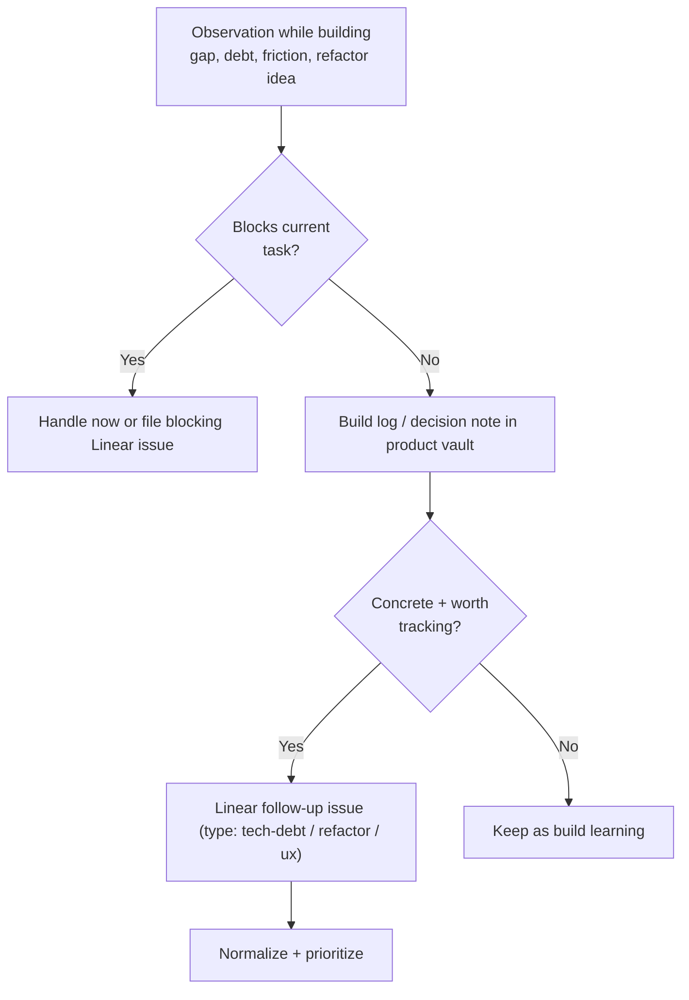

# Product Evolution Pipeline

Per-group deep dive for **Group 2** in [[2.a Task Sources and Intake Groups]]. This is the "we saw a better way while building" group: feature gaps, technical debt, UX friction, and refactors discovered during development.

> **Principle for this group:** a discovery while building should rarely interrupt the current task. Capture it as a build-log entry or decision note; promote to Linear only when the follow-up is concrete, actionable, and worth tracking separately. Automation level: **medium-low**.

## Pipeline

## Intake checklist

- [ ] **Blocking?** — decide interrupt vs. defer before anything else
- [ ] **Concrete follow-up** — a specific change, not a vague "improve this"
- [ ] **Type** — feature-gap / tech-debt / refactor / UX friction
- [ ] **Evidence / rationale** — why it's worth doing, what it unblocks
- [ ] **Decision recorded** — if it changes architecture, link or write an ADR
- [ ] **Effort estimate** — so it can be weighed against roadmap work

## Tactics and tooling

| Need | Tool / artifact |
|---|---|
| Capture without interrupting | Build-log convention in the product vault |
| Architecture decisions | ADRs in repo `docs/adr/` |
| Tech-debt visibility | `docs/architecture/TYPE_CHECK_DEBT.md`, `docs/backlog/*`, root `BACKLOG.md` (P0–P3) |
| Follow-up tracking | Linear labels `type:tech-debt`, `type:refactor`, `type:ux` |
| Learning capture | [[3.c Obsidian Learning Loop]] |

## Current state (Canvasm)

- Rich backlog already exists in the repo: `BACKLOG.md` (prioritized P0–P3) and `docs/backlog/*` (per-topic notes), plus ADRs under `docs/adr/`.
- Open P0s flagged in `BACKLOG.md`: autosave, duplicate, version history, evidence persistence.
- The gap is **routing**: these live as markdown in the repo rather than as normalized Linear follow-ups, so they don't flow through triage/prioritization consistently.

## Build backlog

- [ ] Create a **Build-log template** (observation, why it matters, decision, follow-up?) in `Templates/`
- [ ] Reconcile repo `BACKLOG.md` + `docs/backlog/*` into **Linear follow-ups** where items are concrete (keep the rest as learning)
- [ ] Adopt the habit: **decision that changes architecture → ADR**; concrete follow-up → Linear
- [ ] Define the **"promote to Linear" rule** for evolution items (concrete + non-blocking + separately trackable)
- [ ] Tag evolution issues to the **affected `area:*`** so they cluster by product surface

## Related notes

- [[2.a Task Sources and Intake Groups]]
- [[2.a.i Strategy and Discovery Pipeline]]
- [[2.a.iii System Health Pipeline]]
- [[2.b Task Normalization and Taxonomy]]
- [[5. Implementation Roadmap]]
