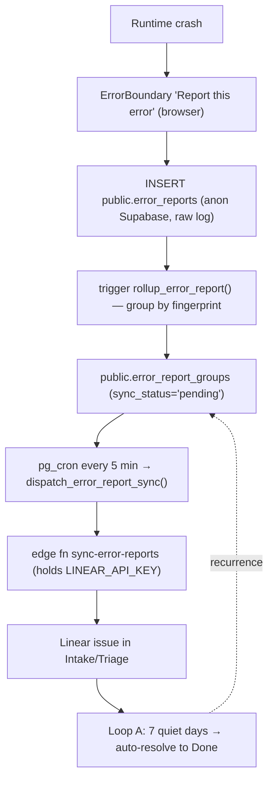

# System Health Pipeline

Per-group deep dive for **Group 3** in [[2.a Task Sources and Intake Groups]]. This is the group that protects the product, and it is the **most automated** — evidence is machine-readable, so it can be captured, deduped, scored, and synced to Linear without human transcription.

> **Principle for this group:** capture evidence automatically, let agents triage, but keep humans on shaping and readiness. Automation level: **high**. See [[4.a System Health Task Intake Prompt]] for the full implementation prompt and [[2.c Agentic Triage Automation and Source Routing]] for the scoring model.

## Pipeline — runtime crashes (LIVE)

The browser only ever writes to Supabase; Linear is reached server-side only. Deduplication is by **fingerprint** (message + top stack frame + top component frame + route, with dynamic ids/hashes scrubbed). Repeats comment on the same issue (rate-limited ~45 min); a quiet fingerprint auto-resolves after `ERROR_RESOLVE_AFTER_DAYS` (default 7); a later recurrence reopens the issue as a regression.

## Intake checklist (per error group)

- [ ] **Fingerprint** computed and stable across deploys/routes
- [ ] **Occurrence count** + first/last seen tracked on the group
- [ ] **Severity/priority** heuristic applied (repeat ≥10× → High)
- [ ] **Labels** attached (existing only): `source:system-health`, `type:bug`, `runtime-error`, `from:error-boundary`, `area:*`
- [ ] **Localhost skipped** unless `ERROR_SYNC_INCLUDE_DEV=true`
- [ ] **Vault secrets** present (`error_sync_url`, `error_sync_secret`) or the cron no-ops
- [ ] **Failed syncs** recorded for retry (`npm run sync:errors -- --retry-failed`)

## Tactics and tooling

| Concern | Tool / artifact |
|---|---|
| Raw evidence store | Supabase `error_reports` (insert-only, RLS-blocked reads) |
| Work unit | Supabase `error_report_groups` (one per fingerprint) |
| Scheduler | Supabase `pg_cron` (`error-report-sync`, `*/5 * * * *`) |
| Server-side bridge | Edge fn `sync-error-reports` (holds Linear key) |
| Secrets | Supabase Vault + function secrets (never in browser/git) |
| Manual run / retry | `scripts/sync-error-reports.mjs` (`npm run sync:errors`) |
| Setup / IDs | Linear MCP (agent-assisted setup only), [[Templates/1. Linear Intake Template]] |
| Passive capture (adopt-vs-build) | **Sentry** — alert-rule → Linear issue, bi-directional resolve, Sentry Agent for root-cause/fix inside Linear |
| Security scanning | **Snyk** — dependency/SAST/container vulns; no native Linear (bridge via GitHub PR checks + API); overlaps Supabase `get_advisors` on the DB side |
| Ship truth | **Linear Releases** — CI (GitHub→Vercel) groups issues into releases; issue → Done on **deploy**, not merge (Business+) |

## Current state (Canvasm)

- **LIVE and verified in prod (2026-07-03):** create → auto-resolve → regression reopen, plus a real production crash that auto-filed **CVS-19**.
- **Only one capture path exists: React runtime exceptions via the ErrorBoundary.** Every other System Health source in `2.a` (failed jobs, performance, security/privacy, build failures, data inconsistency) is **not yet captured** — which is the intended, deliberate starting point.

## Remediation — capture vs fix is a separate decision

Capturing/triaging an issue and *fixing* it sit on two different automation curves. Conflating them is the trap; keep them separate.

- **Loop A — capture / triage / lifecycle** (create → dedupe → comment → auto-resolve → regression reopen). Never writes code. **Automate this aggressively** — it's cheap, safe, needs no judgment, and runs unattended. ✅ Done + live.
- **Loop B — agentic auto-fix** (a *scheduled* Claude Code routine that reads Triage issues, investigates the code, and opens PRs). Writes code. **Automate this only past a threshold** — it's expensive, judgment-heavy, error-prone, and (by our choice) still needs human review on every PR.

> **Decision rule:** automate *capture* unconditionally; automate *remediation* only when **manual fix cost > automation cost + risk**. Until then, default to **on-demand** fixing.

### The on-demand command (the pragmatic middle ground)

Instead of a scheduled robot, package the fix workflow as a **Claude Code slash command you invoke manually** — e.g. `/fix-system-health-issue CVS-42`. It runs the same investigate → fix-on-branch → type-check/lint/test → PR → move to In Review flow we did by hand for CVS-19, then hands back a PR to review.

| | On-demand command (**pull**) | Scheduled routine — Loop B (**push**) |
|---|---|---|
| Trigger | You, when an issue appears | A cron, autonomously |
| Supervision | You're present | Unattended |
| Cost | Only when run | Every tick |
| Risk | Low (human in loop) | Higher (agent picks + acts alone) |

It captures ~90% of Loop B's value (agentic fixing, consistent steps) with none of the scheduling overhead, prompt drift, or unattended-agent risk. "Save the recipe as a button" vs "a robot that presses it on a timer."

### When to graduate to a scheduled Loop B

- Sustained volume: **~3–5+ distinct new System Health issues/week**.
- You're **frequently away** and want issues progressed unattended.
- A backlog of **similar, mechanical** fixes accumulates (agents excel at repetitive).
- You want it as a **product feature for your users** (DOS Phase 4) — a different motivation that justifies it regardless of your own volume.

**Safety gate for any future Loop B:** only auto-fix crashes that **recur** (use Loop A's `occurrence_count` / recurrence signal) — never one-offs. This is why Loop A isn't just "enough for now": it's the foundation that makes autonomous fixing safe later.

**Proof point (CVS-19, 2026-07-03):** the live pipeline auto-filed a real canvas React #185 (infinite re-render) crash → investigated on demand (two parallel analysis agents converged on the root cause: controlled ReactFlow receiving new `nodes`/`edges` identities every render) → fixed → PR #9 → merged. That whole loop *worked manually in one session*, which is exactly why a scheduled Loop B isn't needed at current scale.

## Build backlog — additional capture paths

The automation is proven; the work now is widening the funnel of what counts as a System Health signal. Each becomes its own evidence path that reuses the same fingerprint → group → Linear bridge.

- [ ] **Global JS errors** beyond React: `window.onerror` + `unhandledrejection` (promise rejections)
- [ ] **API / network failures** — 4xx/5xx from Supabase + edge functions, unexpected RLS denials
- [ ] **Failed background jobs / cron / edge functions** — capture failures into `error_reports`-style sink
- [ ] **Performance** — Web Vitals (slow pages) and slow Supabase queries (via `get_logs` / `get_advisors`)
- [ ] **Build / deploy failures** — Vercel deploy failures routed to System Health intake
- [ ] **Security / privacy** — surface Supabase **advisors** (`get_advisors`) as System Health issues
- [ ] **Data inconsistency** — scheduled integrity checks that file a group on drift
- [ ] **In-app admin dashboard** for reading error groups (currently a non-goal)
- [ ] **Auto-prioritization** beyond the repeat heuristic (adopt the `triage_score` model in [[2.c Agentic Triage Automation and Source Routing]])
- [ ] **Decide build vs. adopt** — whether to keep the bespoke pipeline or layer a tool (e.g. Sentry) for breadcrumbs/session context, feeding the same Linear bridge
- [ ] **Evaluate Sentry** — passive capture of the classes above (global JS/promise errors, performance) auto-filing Linear issues via alert rules; run *alongside* the bespoke ErrorBoundary bridge (keep that for user-reported crashes). Weigh vendor + data egress vs. breadth/speed
- [ ] **Evaluate Snyk** — dependency + code security; turn on GitHub PR checks first, bridge selected findings into Linear System Health via the API
- [ ] **Adopt Linear Releases** — connect GitHub→Vercel via the `linear-release` GitHub Action (pipeline access key, path filters); move issues to Done on deploy; key regression detection off "recurred after the fixing release" (Business+ plan)

## Related notes

- [[2.a Task Sources and Intake Groups]]
- [[2.c Agentic Triage Automation and Source Routing]]
- [[4.a System Health Task Intake Prompt]]
- [[2.a.iv Quality and Verification Pipeline]]
- [[5. Implementation Roadmap]]
