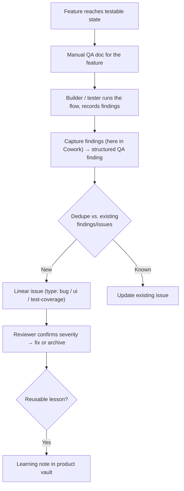

# Quality and Verification Pipeline

Per-group deep dive for **Group 4** in [[2.a Task Sources and Intake Groups]]. This group is what intentional checking reveals: manual QA findings, regression checks, edge cases, visual bugs, and acceptance-test failures.

> **Principle for this group:** manual QA docs are part of the product system, not an afterthought. Findings have structure, so intake can be **semi-automated** — but severity and expected behavior often need reviewer judgment before an issue is real.

## Pipeline

## Intake checklist (per finding)

Use [[Templates/2. Manual QA Finding Template]]. A finding is ready to route when it has:

- [ ] **Feature / flow** tested and **test case**
- [ ] **Steps to reproduce** (numbered)
- [ ] **Expected vs. actual** result
- [ ] **Impact** — severity, frequency, affected role, device/browser
- [ ] **Evidence** — screenshot / recording / console
- [ ] **Classification** — task type, product area, suggested priority
- [ ] **Learning-note needed?** flagged yes/no

## Tactics and tooling

| Need | Tool / artifact |
|---|---|
| Structured capture | [[Templates/2. Manual QA Finding Template]] |
| Manual test tasks | Linear `manual-test` sub-issues in the **Manual Test project** (replaces the all-in-one `docs/tests/manual-test-plan.md`); failures spawn follow-up sub-issues |
| Automated coverage | Vitest (unit/logic), Playwright (browser/flows), Storybook (component states) |
| RLS correctness | `npm run test:rls` (policy tests) |
| Evidence store (proposed) | `qa_findings` table → grouped → Linear (see [[2.c Agentic Triage Automation and Source Routing]]) |
| Acceptance criteria | [[Templates/1. Linear Intake Template]] |

## Current state (Canvasm)

- The **Manual QA Finding Template** and a **manual test plan** exist; Vitest, Playwright, Storybook, and RLS tests are in the stack.
- Today the loop is **manual**: a builder tests a feature, findings are captured here in Cowork and turned into Linear tasks by hand.
- There is **no `qa_findings` evidence table** yet, so QA intake isn't deduped/scored the way System Health is.

## Build backlog

- [ ] **Manual test = a Linear sub-issue, not a doc.** Every implemented feature issue gets a child `Manual test: <feature>` in the **Manual Test project**, labelled `manual-test`, **assigned to the owner** (shows in their Todo), with the PR link + numbered test cases from the acceptance criteria (steps → expected → pass/fail). The feature issue sits in **In Review** until a human passes the sub-issue; only then Done. Failures spawn follow-up sub-issues. Completion gate — see the verification loop in [[3.a Workflow Architecture - Linear Obsidian Agents Product Surfaces CI-CD]].
- [ ] Add a **`qa_findings` evidence table** + semi-automated grouping → Linear sync (mirror the System Health bridge)
- [ ] Grow **Playwright coverage** for the core value flows (build tree → diagnose → govern)
- [ ] Make **acceptance criteria in the Linear issue** a gate before "Ready"
- [ ] Add **visual-regression** checks for key component states (Storybook-based)
- [ ] Wire the **QA → learning-note** loop so recurring findings update a QA checklist or principle
- [ ] Route **visual/layout** bugs here vs. flow issues to Product Evolution (see the design-polish split in `2.a`)

## Related notes

- [[2.a Task Sources and Intake Groups]]
- [[2.a.iii System Health Pipeline]]
- [[2.a.v User and Operations Signals Pipeline]]
- [[2.c Agentic Triage Automation and Source Routing]]
- [[Templates/2. Manual QA Finding Template]]
