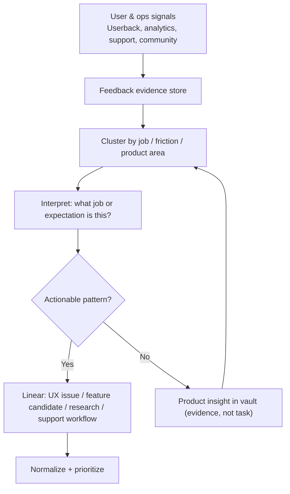
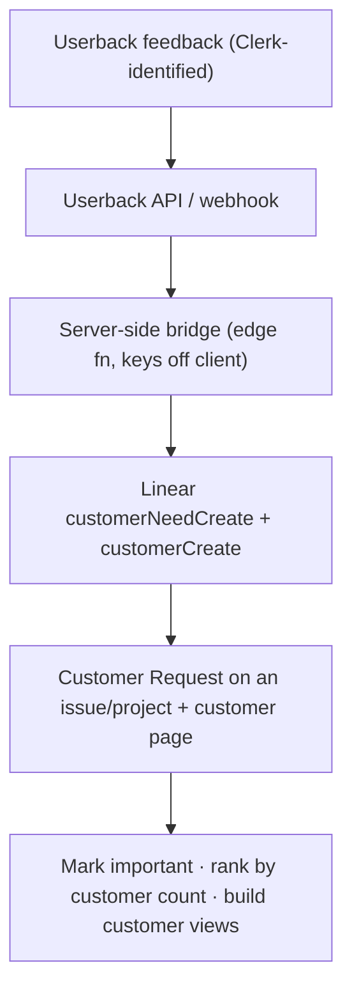

# User and Operations Signals Pipeline

Per-group deep dive for **Group 5** in [[2.a Task Sources and Intake Groups]]. This group comes from reality: user feedback, analytics behavior, support needs, admin/operations pain, and confusion points.

> **Principle for this group:** a user request is evidence of a job, friction, or expectation — not automatically the right solution. Signals must be **clustered and interpreted** before they become Linear work. Automation level: **medium** (group automatically, interpret with judgment).

## Pipeline

## Intake checklist

- [ ] **Signal captured** with user/account context (safely — no sensitive data)
- [ ] **Clustered** with similar signals (not filed one-off)
- [ ] **Job/friction interpreted** — the need behind the request
- [ ] **Evidence** — quote, session, analytics, frequency
- [ ] **Output type decided** — UX issue / feature candidate / research / support / admin
- [ ] **Actionability** — is the pattern strong enough for Linear, or still an insight?

## Tactics and tooling

| Need | Tool / artifact | Status |
|---|---|---|
| In-app feedback | **Userback** (bug / feature / general / visual, Clerk-identified, smart detection) | **Live** |
| Product analytics | **PostHog** — event taxonomy, funnels, retention, session replay, feature flags | To build |
| Structured feedback store | **Linear Customer Requests** — link feedback to issues/projects, customer pages (revenue/tier/size), mark-important, customer-count views | Adopt |
| Userback → Linear bridge | server-side fn: Userback API/webhook → Linear `customerNeedCreate` (keeps keys off the client) | To build |
| Deeper clustering (optional) | `feedback_items` / `feedback_clusters` tables when native Customer Requests grouping isn't enough | To build |
| Onboarding signal | tie analytics to PRD onboarding (`PRD/3. Onboarding/*`, onboarding-to-aha) | To build |
| Community signal | closed-launch cohort, hand-held business owners | To build |
| Interpretation | product insight notes; [[3.c Obsidian Learning Loop]] |  |

## Userback → Customer Requests pipeline

Linear **Customer Requests** gives most of the structured feedback store natively (feedback linked to issues/projects, per-customer pages with revenue/tier/size, "mark important," and customer-count views for prioritization). Userback isn't a native Customer Requests source, but the **API bridges it** — the same server-side pattern as System Health:

- Map the Userback user's **email domain → Customer** (`customerCreate`), then attach the feedback as a request (`customerNeedCreate`).
- For the **closed-community / hand-held business owners**, each owner becomes a Customer, so you can see everything one owner asked for on their page and prioritize by who's asking.
- Keep it server-side (never expose Linear keys in the browser), exactly like the `sync-error-reports` bridge in [[2.a.iii System Health Pipeline]].
- Note native support-tool sources (Intercom/Zendesk/Front) need **Business+**; the manual + **API** path works on lower plans.

## Current state (Canvasm)

- **Userback is live** (`docs/features/USERBACK_INTEGRATION.md`): users submit bug/feature/general/visual feedback, auto-identified via Clerk, with smart-detection prompts.
- **No product analytics yet** — there is no funnel, retention, or session-replay instrumentation, so behavioral signals (drop-off, confusion, dead clicks) are invisible.
- Feedback is collected but **not clustered into a structured evidence store**, so it doesn't route through triage the way System Health does.

## Build backlog

- [ ] **Instrument PostHog** — define an event taxonomy, then build funnels for onboarding-to-aha, retention curves, and session replay for confusion points
- [ ] **Enable Linear Customer Requests** + build the **Userback → API bridge** (`customerNeedCreate` / `customerCreate`) so in-app feedback becomes customer requests linked to work — mirror the System Health server-side bridge
- [ ] Register **community business owners as Customers**, use mark-important + customer-count views to prioritize
- [ ] Add **`feedback_items` / `feedback_clusters`** tables only if native Customer Requests grouping proves insufficient (judgment-gated)
- [ ] Build **marketing incentives for feedback** — referral/reward loop so signal volume grows (ties to `PRD/1. Distribution/*`)
- [ ] Stand up the **closed-community program** — launch to a small cohort, hand-hold business owners, capture direct issues/feedback as a first-party signal source
- [ ] Define a **support workflow** — how support requests become UX issues, docs updates, or feature candidates
- [ ] Connect **onboarding analytics** to the PRD onboarding flows to find and fix friction points
- [ ] Establish the **interpret-before-Linear rule** — cluster + name the job before any feature issue is created

## Related notes

- [[2.a Task Sources and Intake Groups]]
- [[2.a.iv Quality and Verification Pipeline]]
- [[2.c Agentic Triage Automation and Source Routing]]
- [[3.c Obsidian Learning Loop]]
- [[5. Implementation Roadmap]]
