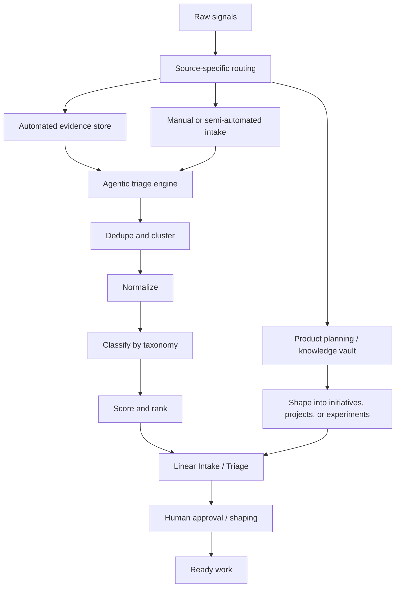
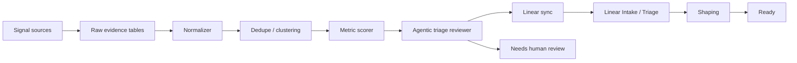

# Agentic Triage Automation and Source Routing

This note refines the intake model.

Not every source should be pushed straight into Linear intake. Some sources are structured enough to automate heavily. Others need product judgment, planning, or synthesis before they become Linear work.

The better model is:



## Main correction

The old diagram made this look like one universal sequence:

```text
Task Intake -> Normalize -> Classify -> Prioritize
```

That is useful for already-captured work, but it hides an important earlier step:

```text
Source -> Routing -> Evidence or Planning or Linear Intake
```

System Health can often be automated into Linear because the evidence is machine-readable. Strategy and Discovery often should start in the product vault because the work needs acute planning before it becomes a task.

## Source-specific routing

| Source group | Default first home | Automation level | Why |
|---|---|---:|---|
| System Health | Evidence store then Linear | High | Errors, logs, routes, fingerprints, frequency, and affected users can be captured automatically |
| Quality and Verification | QA doc or evidence store then Linear | Medium-high | Manual findings have structure, but severity and expected behavior often need reviewer judgment |
| User and Operations Signals | Feedback evidence store and product vault | Medium | Feedback can be grouped automatically, but the real job or solution usually needs interpretation |
| Product Evolution | Product vault build log or Linear follow-up | Medium-low | Some items are concrete follow-ups; others are observations discovered while building |
| Strategy and Discovery | Product vault planning notes | Low | Direction, bets, positioning, and jobs-to-be-done need synthesis before becoming Linear work |

## What can be automated in triage

Agentic triage can safely automate:

- grouping duplicate signals
- counting frequency
- counting unique affected users or accounts
- detecting recurrence after release
- identifying affected route, area, browser, device, or environment
- applying source labels
- suggesting task type
- suggesting severity and priority
- summarizing evidence
- linking related reports to a parent issue
- adding Linear comments with new occurrence summaries
- escalating obvious security, privacy, outage, or data-loss cases
- marking low-confidence items as needing human review

Agentic triage should not fully automate:

- product strategy decisions
- whether a user request is the correct feature to build
- final priority across competing roadmap work
- scope, non-goals, and acceptance criteria for complex work
- moving work to Ready without human or owner approval
- deleting or rejecting ambiguous signals without a review path

## Triage automation architecture

The automation should be a server-side worker or scheduled job, not a browser feature.



### 1. Raw evidence tables

Keep raw signals outside Linear when they are high-volume.

Examples:

- `error_reports`
- `error_report_groups`
- `qa_findings`
- `feedback_items`
- `feedback_clusters`
- `analytics_anomalies`
- `triage_runs`

Linear should track the work item. It should not become the raw event log.

### 2. Normalizer

The normalizer turns raw evidence into comparable fields:

- source group
- source detail
- product area
- route or feature
- task type candidate
- severity candidate
- confidence
- evidence links
- environment
- affected user/account count if safe
- first seen and last seen

### 3. Dedupe and clustering

Use different dedupe methods by source.

| Source | Dedupe method |
|---|---|
| Runtime errors | deterministic fingerprint from message, stack frame, component stack, route |
| Failed jobs | job name, failure reason, payload class, environment |
| QA findings | flow, expected result, actual result, screenshot similarity or text similarity |
| Feedback | embeddings or semantic similarity, user job, product area |
| Product evolution | manual linking or agent-suggested similarity |
| Strategy | planning synthesis, not automatic dedupe |

## Automated ranking

For System Health, the rank can be calculated from evidence.

Example:

```text
triage_score =
  severity_weight
  + frequency_weight
  + unique_users_weight
  + recency_weight
  + core_flow_weight
  + customer_value_weight
  + release_regression_weight
  + security_privacy_weight
  - low_confidence_penalty
```

Suggested inputs:

- occurrence count
- unique affected users
- unique affected accounts
- paid or high-value customer impact
- affected core route or workflow
- release version
- recency
- reproducibility
- security/privacy keywords
- data loss or data corruption indicators
- previous issue status
- whether the issue is a regression

The score should support triage, not replace judgment.

## Linear issue behavior

For high-volume automated sources, create one parent Linear issue per cluster, not one issue per raw event.

Runtime error example:

```text
100 raw error reports
-> 7 fingerprints
-> 7 error groups
-> 7 Linear issues or updates
```

The Linear issue should include:

- normalized title
- source group and source detail
- task type
- product area
- severity
- priority
- confidence
- occurrence count
- unique affected users or accounts, if safe
- first seen and last seen
- latest user note, if any
- evidence links
- related raw report IDs
- current triage recommendation

## Agentic workflow in Linear

The agentic workflow should act on Linear through a controlled sync layer.

### On new signal group

1. Create or update the evidence group.
2. Calculate score and confidence.
3. Search for existing Linear issue by fingerprint, group key, or similarity.
4. If no parent exists, create a Linear issue in Intake or Triage.
5. If a parent exists, update occurrence count and add a rate-limited comment.
6. Add labels and fields.
7. If severe, notify or move to an escalation lane.

### On repeated signal

1. Increment occurrence count.
2. Update last seen.
3. Recalculate score.
4. Update Linear fields if priority or severity changed.
5. Add a comment only when the update is meaningful.

### On post-release recurrence

If the same fingerprint appears after the linked issue is Released:

- create a regression issue, or
- reopen/comment on the original issue if that matches the team's Linear workflow.

For MVP, prefer a new `[Regression]` issue linked to the original.

## Status rules

Agentic triage may move items between:

- Intake
- Triage
- Needs evidence
- Escalation

Agentic triage should not move items to:

- Shaped
- Ready
- In Progress

Those require product or engineering ownership because they imply a defined solution, scope, and commitment.

Exception: a narrow System Health bug with high confidence may be auto-shaped by an agent, but it should still require owner approval before Ready.

## Different source groups need different operating loops

### System Health loop

Best default:

```text
raw event -> group -> score -> Linear issue/update -> human triage -> fix -> QA -> release -> monitor
```

This should be the first fully automated path.

### Quality and Verification loop

Best default:

```text
manual QA finding -> structured template -> dedupe -> Linear issue/update -> reviewer confirms severity -> fix or archive
```

This can be semi-automated.

### User and Operations loop

Best default:

```text
feedback -> cluster by job/friction -> product insight -> Linear only when actionable
```

Do not turn every user request into a feature issue.

### Product Evolution loop

Best default:

```text
build observation -> build log / follow-up candidate -> Linear if concrete and actionable
```

Some items are immediate follow-up work. Others are learning or architecture context.

### Strategy and Discovery loop

Best default:

```text
idea / market learning / job-to-be-done -> product vault synthesis -> initiative / experiment / research -> Linear when ready to execute
```

Linear should track execution, not the entire thinking process.

## Automation maturity ladder

1. Manual triage with consistent fields.
2. Automatic source labels and product-area labels.
3. Automatic grouping and dedupe.
4. Automatic frequency and affected-user counts.
5. Automatic severity and priority suggestions.
6. Automatic Linear issue creation or updates for high-confidence groups.
7. Agentic triage summaries and recommendations.
8. Human approval for shaping and readiness.
9. Product vault learning suggestions after release or repeated incidents.

## MVP recommendation

Start with System Health.

Build:

- raw `error_reports`
- grouped `error_report_groups`
- deterministic fingerprint
- occurrence count
- unique affected user/account count when safe
- severity and priority suggestion
- Linear issue create/update
- rate-limited Linear comments
- failed sync retry
- human review for Shaped and Ready

Then add QA findings.

Delay full automation for Strategy and Discovery until the product planning workflow is clearer.
