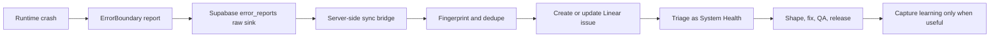

# System Health Task Intake Prompt

This note is the full implementation prompt for turning in-app runtime error reports into Linear System Health intake.

Use this when asking Claude Code or another coding agent to implement the next step after the custom ErrorBoundary and Supabase `error_reports` work.

The prompt embeds the needed operating-system context so it works as a copy-paste handoff. If Claude Code has access to the product Obsidian vault, it should also read and update that vault as the product learning loop.

## Important distinction

The Linear MCP command:

```bash
claude mcp add --transport http linear-server https://mcp.linear.app/mcp
```

gives Claude or another coding agent access to Linear. It is not the app's production integration path.

Production app flow should keep Linear credentials server-side. The browser should submit error reports to Supabase only. A server-side bridge should read or receive reports, dedupe them, and create or update Linear issues.

## Full implementation prompt

````markdown
You are working in the current application repo. Implement the first productized version of System Health task intake: runtime crash reports captured by the app should become deduplicated Linear intake issues with enough evidence for triage.

## Operating-system context

This app follows the Development Operating System:

- Linear is the source of truth for work.
- The product Obsidian vault is the source of truth for durable learning when it is available to Claude Code.
- If no product vault is available, use this prompt as a self-contained handoff and report any learning-note recommendations in the final response.
- The repo is the source of truth for implementation.
- System Health includes runtime errors, reliability issues, performance issues, security/privacy issues, failed jobs, logs, and data inconsistencies.
- Raw signals should enter Linear as Intake or Triage, not directly as build-ready work.

Embedded intake model:

| Source group | Meaning | Examples |
|---|---|---|
| Strategy and Discovery | What should we build and why? | planned work, jobs to be done, hypotheses, experiments |
| Product Evolution | What becomes necessary while building? | feature gaps, technical debt, UX polish, refactors |
| System Health | What is broken, risky, slow, or unsafe? | runtime errors, failed jobs, reliability, performance, security, privacy |
| Quality and Verification | What do we find when testing intentionally? | manual QA findings, regression checks, visual bugs, acceptance failures |
| User and Operations Signals | What do real use and operations reveal? | feedback, analytics, support needs, admin workflow pain |

Embedded normalization fields:

- Title
- Source group
- Source detail
- Product area
- Task type
- Evidence
- Expected outcome
- Severity
- Priority
- Confidence
- Effort
- Dependencies
- Owner or next reviewer
- Links to issue, PR, QA evidence, release, and any knowledge note if available

Embedded Linear status flow:

1. Intake
2. Triage
3. Shaped
4. Ready
5. In Progress
6. In Review
7. QA
8. Released
9. Learned or Archived

For this implementation, created Linear issues should start in Intake or Triage.

Embedded done rule:

An item is done only when implementation is complete, tests or QA evidence exist, the PR or deployment is linked, Linear is updated, and any important reusable learning is captured somewhere accessible to the team.

## Existing app context

The app already has custom crash reporting:

- `src/shared/components/common/error/ErrorBoundary.tsx`
- `src/shared/lib/supabase/services/errorReports.ts`
- `supabase/migrations/20260703120000_error_reports.sql`
- `src/shared/lib/supabase/types.ts`

The current ErrorBoundary shows technical details, lets the user add a note, and inserts crash reports into `public.error_reports` using the anon Supabase client.

Important constraints:

- The ErrorBoundary is above Clerk, Query, and Theme providers, so fallback UI cannot rely on hooks.
- The fallback reads identity hook-free from `useAppStore.getState().user`, with `window.Clerk` fallback.
- The fallback renders its own Sonner Toaster.
- `error_reports` is an insert-only sink for anon and authenticated clients.
- Client reads are intentionally blocked by RLS.
- Anon inserts must keep working because crashes can happen before auth is ready.

## Goal

Create a server-side bridge from Supabase `error_reports` to Linear so System Health signals become trackable work.

The bridge should:

1. Preserve the existing browser-to-Supabase crash-report flow.
2. Avoid exposing any Linear credential to the client.
3. Create a Linear issue for a new error fingerprint.
4. Update or comment on an existing Linear issue when the same fingerprint appears again.
5. Store Linear sync metadata back on the report or report group.
6. Keep all created issues in Linear Intake or Triage, not Ready or In Progress.

## Recommended architecture

Prefer this order unless the existing repo clearly suggests another server-side pattern:

1. Supabase Edge Function or backend route with service-role access.
2. Scheduled sync or queue worker that processes unsynced `error_reports`.
3. Optional admin/manual action for retrying failed syncs.

Do not call Linear directly from the browser.

Use Linear MCP only for agent-assisted setup and verification if available. Runtime integration should use a server-side Linear API token or official server-side SDK/API pattern already used in the repo.

## Data model changes

Add only the minimum needed for MVP.

At minimum, support:

- `fingerprint`: stable hash generated from message, top stack frame, component stack top, and route/path.
- `linear_issue_id`
- `linear_issue_url`
- `linear_sync_status`: `pending`, `synced`, `failed`, or `skipped`
- `linear_synced_at`
- `linear_sync_error`

If grouping is cleaner, introduce an `error_report_groups` table:

- `fingerprint`
- `title`
- `first_seen_at`
- `last_seen_at`
- `occurrence_count`
- `severity`
- `linear_issue_id`
- `linear_issue_url`
- `sync_status`
- `sync_error`

Keep `error_reports` as the raw event log. Use the group as the Linear issue unit.

## Fingerprinting

Generate a deterministic fingerprint that groups repeated crashes without merging unrelated issues.

Suggested inputs:

- error message
- first meaningful stack frame
- first meaningful React component stack frame
- route pathname, not full URL query string
- app version or release only if available and useful

Do not include:

- user ID
- email
- note text
- timestamp
- full URL query values that may contain IDs or private data

## Linear issue mapping

Create Linear issues with:

- Source group: System Health
- Source detail: Runtime error report
- Type: Bug or Reliability
- Status: Intake or Triage
- Severity: derived from evidence, default Medium
- Priority: default Medium unless the error blocks a core route or repeats heavily
- Product area: inferred from route when possible
- Labels:
  - `source:system-health`
  - `type:bug`
  - `area:<product-area>` when known
  - `runtime-error`
  - `from:error-boundary`

## Linear issue title

Use a concise human-readable title.

Format:

```text
Runtime error on <route or area>: <short error message>
```

Example:

```text
Runtime error on /dashboard: Cannot read properties of undefined
```

## Linear issue body

Include structured evidence using this shape:

START_LINEAR_ISSUE_BODY

## Summary

Runtime crash reported by the in-app ErrorBoundary.

## Classification

- Source group: System Health
- Source detail: Runtime error report
- Task type: Bug
- Product area:
- Severity:
- Priority:
- Confidence:

## Impact

- Occurrences:
- First seen:
- Last seen:
- Affected route:
- Affected users/accounts if safely available:

## User note

<latest user note, if provided>

## Error

- Message:
- Fingerprint:
- Client time:
- User agent:

## Stack

<error stack truncated to safe length>

## React component stack

<component stack truncated to safe length>

## Links

- Supabase table: `error_reports`
- Related reports:
- Knowledge note: optional; omit if unavailable

END_LINEAR_ISSUE_BODY

## Deduping behavior

- If a fingerprint has no open Linear issue, create one.
- If a fingerprint has an open Linear issue, add a comment or update the description with a new occurrence summary.
- If an issue is Done or Released and the same fingerprint appears again after release, create a regression issue or reopen/comment depending on the existing Linear workflow. For MVP, create a new issue titled `[Regression] ...` and link the original.
- Avoid creating more than one Linear comment per fingerprint within a short rate window, such as 30 to 60 minutes.
- Do not create Linear issues for obvious local development errors unless environment sync is explicitly enabled.

## Privacy and safety

- Never send access tokens, cookies, JWTs, auth headers, full local storage, or full app state.
- Scrub query strings and stack lines for secrets where possible.
- Truncate long stack traces and notes.
- Maintain current RLS: anon/auth insert only, no client select.
- Add server-only env vars:
  - `LINEAR_API_KEY` or equivalent
  - `LINEAR_TEAM_ID`
  - `LINEAR_WORKSPACE_URL` optional
  - `LINEAR_DEFAULT_STATUS_ID` or status lookup by name
  - `LINEAR_DEFAULT_ASSIGNEE_ID` optional
  - `LINEAR_PROJECT_ID` optional

## UI behavior

Keep the current ErrorBoundary UX simple:

- User clicks "Report this error".
- App inserts to Supabase.
- Show success when the report is stored, not when Linear sync completes.
- Do not block the crashed UI on Linear.
- Optional: after successful insert, show "Report received" only. Do not expose Linear internals to end users.

## Admin/debug behavior

Add a server-side retry path or script if simple:

- process unsynced reports
- retry failed reports
- print or return created Linear issue URLs
- safe to run locally with server-only env vars

## Verification

Run the repo's standard checks:

- type-check
- lint
- build
- test suite

Also verify:

- anon error report insert still succeeds
- anon select is still blocked
- one new crash creates one Linear issue
- repeated same crash updates or comments on the same issue
- different fingerprint creates a separate issue
- Linear credential is never bundled client-side
- failed Linear sync does not prevent error report insertion
- sync failure is recorded for retry

## Deliverables

Return:

- files changed
- database migration summary
- env vars required
- Linear team/status/label setup needed
- tests run
- manual verification steps
- product vault note updated, if a reusable learning was created
- any follow-up issue recommendations

## Non-goals for MVP

- In-app admin dashboard for reading all reports
- Automatic product decisions or prioritization
- Knowledge note creation for every error
- Full incident management
- Replacing Supabase with Linear as the raw report store
````

## Claude Code embedding options

Claude Code can use this workflow in three ways.

### Option A - Preferred product vault access

Launch Claude Code from the app repo with the product Obsidian folder added as an additional directory.

Example WSL command:

```bash
CLAUDE_CODE_ADDITIONAL_DIRECTORIES_CLAUDE_MD=1 claude --add-dir "/mnt/c/Users/Nadeem/Desktop/Obsidian/build-blog/build-vault/5. Idea Vault/Application/B2B/Active/Canvasm - Easy Workflow"
```

Then keep repo implementation in the repo, and write durable learning into the product vault.

### Option B - Repo memory fallback

If Claude Code cannot read the product vault yet, create a concise project memory file in the app repo:

```text
CLAUDE.md
```

or:

```text
.claude/CLAUDE.md
```

Use this for short, always-relevant rules:

```markdown
# Development Operating System

- Linear is the source of truth for work.
- Runtime crashes are System Health intake.
- Error reports must flow browser -> Supabase -> server-side Linear sync.
- Never expose Linear credentials in the browser.
- New automated issues must start in Linear Intake or Triage.
- Dedupe repeated crashes by fingerprint before creating more Linear issues.
- Keep Supabase `error_reports` as the raw evidence store.
- Capture durable learning in the product vault when it is available. If unavailable, mention the recommended note in the final handoff instead of creating repo product-memory docs.
```

### Option C - Recommended task skill

For this longer implementation workflow, create a Claude Code project skill inside the app repo:

```text
.claude/skills/system-health-intake/SKILL.md
```

Put the full implementation prompt in that `SKILL.md`. Then invoke it in Claude Code with:

```text
/system-health-intake
```

Suggested skill header:

```markdown
---
description: Implement System Health runtime error intake by syncing Supabase error_reports to deduplicated Linear issues.
disable-model-invocation: true
---
```

This is better than putting the whole long prompt in `CLAUDE.md` because the large procedure loads only when you need it.

### Option D - Simple copy-paste handoff

If you do not want repo files yet, copy only the content inside **Full implementation prompt** into Claude Code. That section is self-contained and no longer depends on external links.

## Discussion notes

The strongest MVP is not "send every error directly to Linear from the client." The better loop is:



This keeps the product safe:

- the user-facing report flow stays fast and resilient
- Linear credentials stay private
- repeated crashes become one trackable issue instead of noisy duplicates
- Supabase remains the raw evidence store
- Linear becomes the work item, not the event log

## Linear setup checklist

Before or during implementation, make sure Linear has:

- Intake or Triage status for the target team
- labels for `source:system-health`, `type:bug`, `runtime-error`, and `from:error-boundary`
- area labels for the main product surfaces
- a default team for automated System Health intake
- a decision on whether repeated post-release crashes reopen the original issue or create a regression issue

## Product decisions still needed

These can be decided before coding or left as explicit defaults in the implementation:

- Should staging errors sync to Linear, or only production?
- Should user notes be included in Linear issue bodies by default?
- What is the threshold for raising priority automatically?
- Should repeated crashes add Linear comments, update one issue description, or both?
- Who owns daily System Health triage?
- When does a System Health issue require a knowledge note or postmortem?

## Suggested MVP scope

Start with:

1. Add fingerprint and Linear sync metadata.
2. Add a server-side sync function or job.
3. Create one Linear issue per fingerprint.
4. Update occurrence count for repeats.
5. Record sync status and errors.
6. Keep the existing ErrorBoundary UI almost unchanged.

Leave admin dashboards, rich incident workflows, analytics correlation, and automatic learning notes for later.
