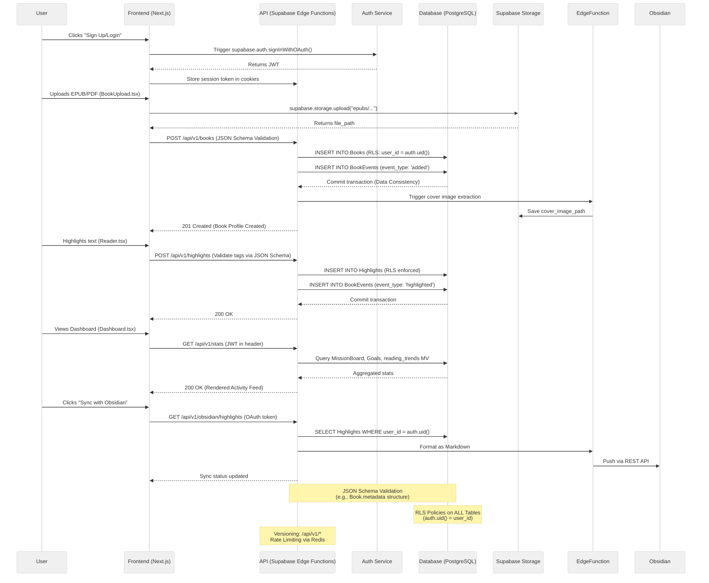

https://www.youtube.com/watch?v=OFkVBi_9FPI

First of all we have to understand the flow of creating a new app, and adding a new feature is totally different.

Personally, I believe that when we're creating a new app, our main focus would on defining the app proposition to user (defining features and core functionalities) and aswell creating a good infrastructure (API Design, database schema, etc) for the purpose/mission of the proposition. 

While adding a feature require to touch all of that, however it's different from "Creating" and "Adding". 

Here we want to define, the workflow for each. Let's begin with Creating.

1. Building early PRD through Ideation Process.
2. Building a Complete PRD for Creation.
	1. Documentation(User Experience + Flow + Action) + Technical(Layout + Page + Components) = Diagramming  
3. Drafting early TRD.
4. Completing a TRD. 
5. Foundation Building
	1. (Complete PRD + Complete TRD) / Core Functionalities - (Features + Optional) = Foundation 
	2. [[Musk's Engineering Principle|Implement the simplification process.]]
6. Scaffolding and Early Deployment.
	1. During PRD, you would refine the foundation of the app. Use that to build on bolt.new. Such foundation would be the tech stack, the most important core functionalities (where everything will be built on top of this), the database schema/architecture, back-end deployment.  Our goal here is to "Start with the foundation, and deploy it fast."

product management (prd, wireframe etc) -> design prototype -> builder.io / lovable.dev for fast architecture/foundation of the app -> optimize/review code manually -> launch

New Feature

TRD (Technical Requirement)

The point of TRD is to produce the requirement that is needed to develop the TDD.

Well it's TDD (Technical Design Document) 
You can also work on SDD (System Design Document)

Breakdown

PRD
TRD
Bolt.

PRD should have at least 2 docs:
7. For the overview and core functionalities
8. For the design, future features etc. 

The first one is what we're gonna need to prompt.

After the PRD, next you want to build a TRD.

Within a TRD there should be, a proposition of tech stack, proposition of computation logic, database, deployment strategy. 

TRD should gives a complete understanding of the app scaffolding. 

From TRD and PRD, you can now breakdown the 

User Flow + Data Flow (Schema Design) 

outline how users will interact with an application, detailing the flow, data, and API interactions

9. UI Component (Front-end component) 
10. User Action
11. Trigger and Functionality 
12. Database Interaction (With data consistency)
13. API Design (Considering versioning, security, JSON Schema and JSON Schema Validation)

[API Design + Architecture Statement by Patrick Collison (Stripe CEO)](https://www.youtube.com/shorts/0K4a05y36c4)

