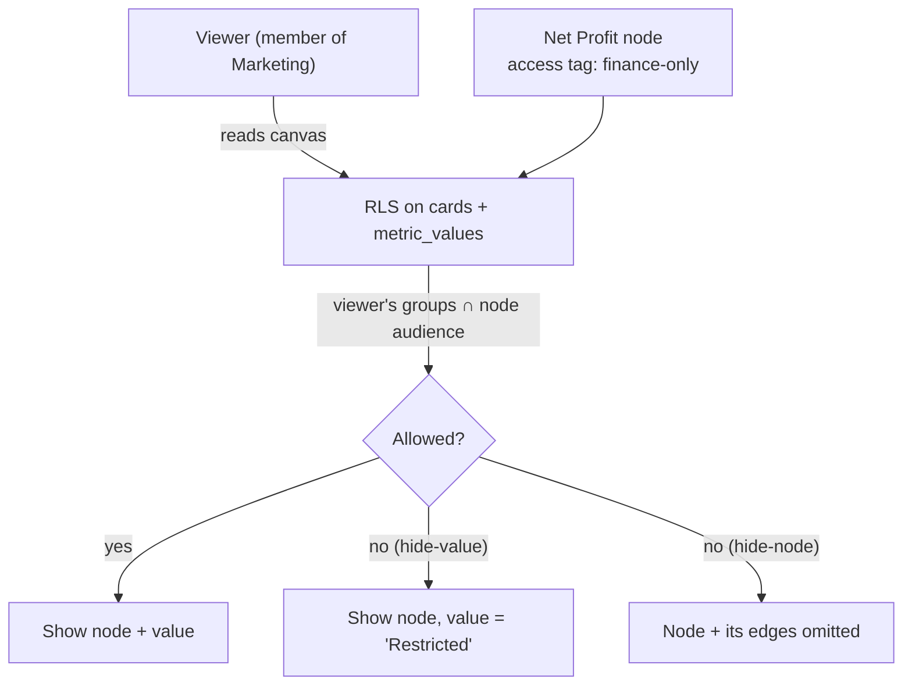

# Access and Visibility (Node-level Transparency) — Design

Design doc for **node-level access control** on the canvas. Shaped output of the design spike (Linear **CVS-118**) so the build issues **CVS-119 → CVS-123** can proceed. Project: *Access & visibility (node-level transparency)*.

## Why this matters

The driver tree is meant to be the **shared source of truth that drives the whole team** — everyone reasons off the same map. But **not everything can be shown to everyone**: Net Profit, margins, payroll, CAC/LTV by channel, revenue by customer. Without granular visibility a business owner is stuck in a lose-lose:

- **over-share** → leak sensitive numbers to people who shouldn't see them, or
- **don't share** → the tree stops being a team tool and reverts to a private artifact.

**Node-level visibility is what makes a company-wide driver tree safe to share.** Finance sees the whole picture; Marketing sees their branch; nobody sees Net Profit who shouldn't — on the *same* canvas.

## Current state (what we build on)

- **Org-collaborative permissions** (PRD `5. Current State/3. Permissions and Roles`): workspace = Clerk org; **all members get full edit**. Roles (Viewer / Commenter / Editor / Admin) only gate **outside guests**. **No within-workspace tiering yet** — so today Finance and Marketing in the same workspace see everything.
- **Tags already exist:** `tags`, `metric_card_tags`, `relationship_tags`; cards carry `tags[]`.
- **RLS** is workspace-scoped and Clerk-hardened; `permission_tiers` + `metric_values` migrations exist; `npm run test:rls` covers the guest tiers.

So this **extends** the model — it doesn't invent a new one.

## The model — tag × group, enforced at RLS

1. **Groups / departments (new):** groups *within* a workspace (Finance, Marketing, Exec); a user belongs to 1+. Introduces internal tiering that doesn't exist today.
2. **Access tags with an audience:** reuse the existing tag system — a tag can be marked an **access tag** carrying an **audience** (allowed groups). Assign it when creating/editing a node (and on dashboards). **No access tag = visible to everyone with canvas access.**
3. **Two redaction modes** (per node / policy):
   - **Hide value** (default): node + relationships stay, the number/series shows **"Restricted"** — preserves the tree's shape so the map still reads.
   - **Hide node**: node + its edges are omitted for unauthorized viewers — for truly secret items.
4. **RLS is the hard boundary:** policies on `cards`/nodes and `metric_values` check the viewer's **group membership ∩ node access-tag audience**. Unauthorized rows are filtered (hide-node) or value-redacted (hide-value). **A marketer can't fetch Net Profit even via the API or MCP.** The UI is convenience; RLS is the wall.
5. **Dashboard / canvas audience:** assign an audience to a dashboard or shared view so it only surfaces permitted metrics; the existing share flow (People tab / roles) honors node visibility.

## The hard problem — information leakage

A restricted node that **drives** a visible metric can leak through the **edge** (its existence/label) or the **derived value** (you can back it out). This is the real design call:

- Hide **edges** touching restricted nodes from unauthorized viewers (baseline).
- Decide whether metrics **derived from** restricted inputs are **also masked** — strict (mask anything downstream of a secret) vs. permissive (show the output, hide the input). Recommend **configurable**, default strict for anything one hop from a restricted input.

## Enhancement — access derived from the data source

From the motivating example (an accounting connection only accountants can reach): a metric **sourced from a restricted connection** could **inherit** restriction automatically — access follows the data source. Cleaner than tagging each node by hand. (Ties to Connected accounts, CVS-90.)

## Decisions the spike settles — LOCKED (CVS-118, 2026-07-05)
Full build contract in the CVS-118 "Decision (locked)" comment. Summary:
- **Group model:** NEW `workspace_groups` + `group_members`, scoped by `workspace_id = requesting_org_id()`; helper `my_groups()` (SECURITY DEFINER). Clerk org stays the tenant boundary. (Not Clerk roles.)
- **Access-tag model:** extend tags — `is_access` flag + `tag_audiences(tag_id, group_id)`; per-node `node_access_grants` as the allowlist escape hatch. No access tag ⇒ visible to all with canvas access.
- **Redaction default: hide-value** (`tags.redaction_mode` ∈ {hide_value, hide_node}); hide-node also omits incident edges.
- **Enforcement:** central `node_visible_to_me(card_id)` (SECURITY DEFINER, fail closed) = no-tag OR `has_project_access(project_id,true)` OR `tag_audiences ∩ my_groups() ≠ ∅` OR `node_access_grants` match. Policies on `metric_cards`, edges, and `metric_values` (values gated per-card via `metric_values → tracked_metrics → metric_cards` join — finalized in CVS-121).
- **Info-leak:** edge-hiding for hide_node in v1; derived-metric masking configurable, default strict one-hop (deeper transitive = follow-up).
- **Data-source-derived access:** OUT of v1 (defer to Connected accounts CVS-90).
- **Proxy departments (CVS-136):** canvas-scoped alias that resolves into groups/access-tags first; never touches RLS directly; inheritance dashboard→group→node, most-specific wins. **v2**, after CVS-121.

## Data-model additions
- `workspace_groups`, `group_members` (RLS-scoped).
- Access-tag audience: `tag_audiences` (tag → group) or an `is_access` + audience on tags.
- Node redaction mode (per node/tag).
- RLS policies on `cards`, edges/relationships, `metric_values`.
- `visibility_audit` (who set what audience, when).

## UX
- Per-node **"Who can see this"** control + a **lock / Restricted badge**.
- Redacted rendering for unauthorized viewers (masked value or omitted node).
- Admin **access matrix** (access tags × groups) + **"view as <group>"** preview for owners.
- Dashboard **audience picker** + "hides N restricted metrics for this audience".

## Phased plan (Linear)
`CVS-118` spike (this) → **`CVS-119`** groups · **`CVS-120`** access tags + policy → **`CVS-121`** RLS enforcement → **`CVS-122`** redaction UX + admin matrix · **`CVS-123`** dashboard audience. Critical path: spike → (groups + tags) → RLS → (UX + dashboard).

## Principles
1. **RLS is the boundary; UI is convenience.** If it's only hidden in the client, it isn't hidden.
2. **Fail closed** — unknown/ambiguous → restricted, never exposed.
3. **Default to hide-value** so the tree's structure survives redaction.
4. **Make "who sees what" auditable** — owners must be able to see and preview it.

## References
- PRD `5. Current State/3. Permissions and Roles`; existing tags + workspace-scoped RLS + permission tiers.
- Linear: CVS-118 → CVS-123. Related: **CVS-93** (workspace settings, where groups are managed), **CVS-90** (connected accounts → source-derived access), **CVS-89** (API keys / MCP access must respect this too).
