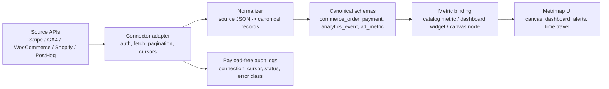

# Canonical Schemas and Native Connectors - Design

Design doc for the **Metrimap canonical data layer and native connector runtime**. This complements **CVS-90** (Connected accounts UI), **CVS-98 to CVS-104** (MCP/API push path), and the current object model where operationalized metrics move into the workspace Metric Catalog.

## Why

Metrimap should not become a pile of one-off integrations. The product needs a durable data contract:

1. Connect to a source API.
2. Pull only the source objects needed for the user's question, dashboard, or metric binding.
3. Normalize each source object into a small set of canonical schemas.
4. Answer the query, populate a metric, or update a dashboard.
5. Discard source payloads unless the customer explicitly chooses a storage destination.

This makes every integration reusable. Stripe payments, Shopify orders, WooCommerce orders, PayPal transactions, and marketplace settlements can all feed the same **payment**, **commerce_order**, **refund**, **payout**, and **ledger_entry** contracts. GA4, PostHog, Google Ads, Meta Ads, and TikTok Ads can all feed canonical **analytics_event**, **page_metric**, **ad_campaign**, and **ad_metric** contracts.

## Product framing

Metrimap is the business architecture layer, not the warehouse. Native connectors exist so operators can bind real numbers to the canvas quickly:

- A business owner asks, "What drove profit down this week?"
- Metrimap queries commerce, payments, analytics, and ads sources.
- The connector layer normalizes the answer into canonical business objects.
- The Metric Catalog receives clean tracked metrics and freshness metadata.
- The canvas shows the business structure and the latest values without exposing raw third-party payloads.

## The decision

Build Canvasm/Metrimap around **canonical schemas first**, connectors second.

Connectors are transport adapters. They authenticate, fetch, page, retry, and map fields. They should not define the product's semantic model. The canonical schemas define the model:



## Non-goals

- Do not build a permanent customer data warehouse in v1.
- Do not store raw third-party payloads by default.
- Do not make Airbyte the primary user-facing connector path.
- Do not create separate metric logic per integration.
- Do not support every source in the first release; build the runtime and prove it with a narrow MVP.

## Source reality check

Important current API notes from official docs:

- WooCommerce exposes a REST API for store resources such as orders, products, customers, coupons, taxes, reports, and webhooks. Source: https://developer.woocommerce.com/docs/apis/rest-api/
- Shopify's REST Admin API is legacy as of October 1, 2024, and new public apps from April 1, 2025 should use the GraphQL Admin API. Source: https://shopify.dev/docs/api/admin-rest
- GA4 reporting should use the Google Analytics Data API for reports, realtime reporting, funnels, and metadata. Source: https://developers.google.com/analytics/devguides/reporting/data/v1
- Stripe's API is REST-like, resource-oriented, and returns JSON-encoded responses. Source: https://docs.stripe.com/api
- PostHog exposes project, query, event, person, feature flag, and related APIs, with rate limits and export considerations. Source: https://posthog.com/docs/api
- Airbyte already ships connector references for Stripe and WooCommerce, but its product model is data replication into destinations. Source: https://docs.airbyte.com/integrations/sources/stripe and https://docs.airbyte.com/integrations/sources/woocommerce
- Malaysia MyInvois exposes e-Invoice API operations for document submission, cancellation, retrieval, search, validation, taxpayer lookup, and notifications. Source: https://sdk.myinvois.hasil.gov.my/einvoicingapi/

## Business lenses

These lenses define the integration backlog and the default dashboard packs:

| Lens | Core questions | Canonical focus |
| --- | --- | --- |
| Ecommerce / DTC | What drove sales, margin, refunds, CAC, ROAS? | orders, line items, products, customers, payments, refunds, ads |
| Marketplace sellers | Which channel, SKU, settlement, or commission changed profit? | orders, payouts, fees, inventory, settlements |
| SaaS / subscription | What changed MRR, churn, trials, invoices, failed payments? | subscriptions, invoices, payments, customers, usage |
| Retail / F&B / POS | What is happening by outlet, product, staff, and payment method? | orders, inventory, payment methods, outlets |
| Services / agencies | What is happening across leads, deals, invoices, projects, receivables? | leads, deals, invoices, customers, ledger entries |
| Creator / media | Which content, channel, affiliate link, or campaign drove outcomes? | social posts, engagement, affiliate revenue, campaign metrics |
| B2B sales / support | Which account, renewal, ticket, or pipeline step needs attention? | leads, deals, tickets, customer health |
| Malaysia SME / compliance | Are local payments, invoices, settlements, and e-Invoices healthy? | payments, invoices, tax documents, ledger entries |

## Canonical schema families

### Commerce

- `commerce_order`
- `order_line_item`
- `product`
- `inventory_item`
- `customer`
- `cart`
- `fulfillment`

### Payments and finance

- `payment`
- `refund`
- `payout`
- `balance_transaction`
- `invoice`
- `subscription`
- `ledger_entry`
- `dispute`
- `tax_document`

### Analytics and product usage

- `analytics_event`
- `page_metric`
- `funnel_step`
- `cohort`
- `feature_flag`
- `session`

### Marketing and media

- `ad_campaign`
- `ad_metric`
- `social_post`
- `social_engagement`
- `email_campaign`
- `search_query_metric`
- `video_metric`

### Sales and support

- `lead`
- `deal`
- `company`
- `ticket`
- `customer_health`

## Minimum canonical record contract

Every canonical record should carry the same envelope:

```json
{
  "schema": "payment",
  "schema_version": "1.0.0",
  "source": "stripe",
  "source_account_id": "acct_...",
  "source_object_id": "pi_...",
  "workspace_id": "...",
  "observed_at": "2026-07-04T00:00:00Z",
  "occurred_at": "2026-07-03T12:30:00Z",
  "currency": "MYR",
  "amount": 12900,
  "amount_unit": "minor",
  "attributes": {},
  "lineage": {
    "connector_version": "stripe@1.0.0",
    "cursor": "created:...",
    "normalizer_version": "payment@1.0.0"
  }
}
```

Rules:

- Use minor currency units for money unless a source cannot provide exact minor-unit values.
- Keep source identifiers for lineage and dedupe.
- Keep schema versions explicit.
- Keep source-specific extras in a typed `attributes` object only when they are needed for a known use case.
- Do not store raw payloads by default.

## Connector spec

Each connector should be described by a manifest that the runtime can load, validate, and expose in Settings:

```json
{
  "id": "stripe",
  "display_name": "Stripe",
  "category": "payments",
  "auth": {
    "type": "oauth2_or_restricted_api_key",
    "recommended_scope": "read_only"
  },
  "mode": "live_query",
  "storage": {
    "source_payload": "none",
    "cache_ttl_seconds": 0,
    "customer_destination_supported": true
  },
  "streams": [
    {
      "name": "payment_intents",
      "canonical_schema": "payment",
      "cursor": "created_at",
      "supports_incremental": true
    },
    {
      "name": "subscriptions",
      "canonical_schema": "subscription",
      "cursor": "updated_at",
      "supports_incremental": true
    },
    {
      "name": "payouts",
      "canonical_schema": "payout",
      "cursor": "arrival_date",
      "supports_incremental": true
    }
  ]
}
```

## Runtime architecture

### 1. Connector registry

Stores connector manifests, stream metadata, auth requirements, rate-limit behavior, cursor strategy, storage policy, and normalizer version.

### 2. Connection layer

Owns OAuth, API-key connections, token refresh, revocation, workspace scoping, permission checks, and safe status display. This extends **CVS-90** rather than replacing it.

### 3. Fetch layer

Responsible for API calls, pagination, retries, rate limits, backoff, cursor advancement, and request shaping. It should be source-aware but product-semantics-light.

### 4. Normalization layer

Maps source JSON into canonical records. This is where source-specific naming, currency, timezone, status, and nested object quirks get resolved.

### 5. Query and binding layer

Turns canonical records into:

- live dashboard answers,
- tracked metric values,
- catalog metric candidates,
- source-backed metric cards,
- alert inputs,
- time-travel snapshots.

### 6. Observability and audit layer

Logs connection events, stream runs, cursor movement, errors, rate-limit waits, normalizer failures, record counts, and metric materialization reports. Logs stay payload-free.

## No-storage model

The no-storage promise should be precise:

Metrimap can avoid storing source customer data by default, but it still must store:

- encrypted tokens or connection secrets,
- connection metadata,
- workspace/user permissions,
- stream cursors,
- connector manifests and versions,
- payload-free audit logs,
- materialized metric values when the user binds a source to a tracked metric.

For historical dashboards, offer three modes:

1. **Live query**: query the source each time. Lowest storage, slower, rate-limit-sensitive.
2. **Metric materialization**: store only normalized metric values needed by the canvas/catalog.
3. **Customer-owned destination**: write normalized records to the customer's Sheets, BigQuery, Snowflake, or other warehouse when they want history and drill-down.

## MVP connector sequence

### Tier 0 - manual and schema proving

- CSV upload / Google Sheets-style tabular import.
- Manual metric value push through MCP/API.
- Purpose: prove canonical schemas and metric binding before OAuth complexity.

### Tier 1 - native MVP

1. GA4: analytics acquisition, page, event, conversion metrics.
2. Stripe: payments, refunds, subscriptions, invoices, payouts.
3. WooCommerce: orders, line items, products, customers, refunds.
4. Shopify: GraphQL Admin API for orders, products, customers, refunds, inventory.
5. PostHog: events, persons, cohorts, feature flags, funnels.

### Tier 2 - money and marketing expansion

- PayPal, Square, Billplz, iPay88, Razer Merchant Services, SenangPay.
- Google Ads, Meta Ads, TikTok Ads.
- QuickBooks, Xero, Zoho Books.

### Tier 3 - local/Malaysia and long tail

- Niagawan, Bukku, AutoCount, SQL Account.
- LHDN MyInvois.
- Shopee, Lazada, TikTok Shop, Amazon Seller Central.
- HubSpot, Salesforce, Klaviyo, Mailchimp.
- Airbyte-based research/adapter for long-tail connectors where native UX is not yet justified.

## How this relates to MCP/API

There are two ingestion paths:

| Path | Who fetches | Shape | Related work |
| --- | --- | --- | --- |
| Native pull | Metrimap | Source API -> canonical schemas -> metric/catalog/dashboard | This design, CVS-90 |
| Agent push | User's agent | Agent fetches elsewhere -> MCP/API -> canonical schemas or metric values | CVS-98 to CVS-104 |

Both paths should share:

- canonical schema definitions,
- validation,
- metric binding,
- materialization,
- audit and RLS behavior,
- source lineage.

## UX surfaces

### Settings - Connected Accounts

Build on **CVS-90**:

- connector catalog,
- connect/disconnect,
- permission scopes,
- last sync / last query,
- rate-limit and health status,
- "what data Metrimap stores" explanation,
- revoke and delete connection data.

### Source-backed metric card

When binding a metric card:

- choose source,
- choose stream / canonical schema,
- choose metric recipe,
- preview sampled normalized records,
- map dimensions and filters,
- confirm materialization mode.

### Dashboard query

User asks a business question or opens a dashboard:

- dashboard specifies required canonical inputs,
- runtime queries only necessary streams,
- result shows freshness and source lineage,
- missing permissions or stale sources are visible.

### Admin/debug panel

For owners/admins:

- connector run history,
- last cursor,
- records fetched / normalized / rejected,
- top error class,
- retry / reconnect,
- delete connection metadata.

## Security and privacy principles

1. **Least privilege**: request read-only scopes first; do not ask for write scopes unless a connector needs them later.
2. **Payload-free logs**: never log customer payloads or tokens.
3. **RLS everywhere**: connection metadata, metric values, and audit rows are workspace-scoped.
4. **Fail closed**: if token scope, workspace identity, or access policy is ambiguous, do not fetch.
5. **Token hygiene**: encrypted at rest, server-only, revocable, rotated/refreshed safely.
6. **Explicit retention**: user can see what is stored: tokens, metadata, cursors, audit, metric values.
7. **Source-derived access**: metrics sourced from restricted connections can inherit visibility restrictions from the connection.

## Open questions

- Should canonical records be persisted transiently in a short-TTL table, or only streamed in memory except when materialized into metrics?
- Should schema validation use JSON Schema, Zod, or both? Recommendation: Zod for runtime code, JSON Schema for manifest/external contract export.
- Should connector manifests live in repo code, database, or both? Recommendation: versioned in repo, projected into database for UI.
- How should a connector choose target workspace when a user belongs to multiple Clerk orgs?
- What is the minimum "sample preview" size that helps users trust the mapping without storing source payloads?
- How strict should source-derived access be when a restricted source drives an unrestricted downstream metric?

## Phased Linear plan

1. Spike: settle canonical schemas, storage modes, and MVP connector sequence.
2. Schema package: implement canonical contracts, validation, versioning, and lineage.
3. Connector registry: implement manifest format and runtime registry.
4. Connection secrets: extend connected accounts with token lifecycle and workspace scoping.
5. Normalization runtime: source JSON to canonical records with validation/rejection reports.
6. Query/materialization runtime: bind canonical streams to Metric Catalog and metric values.
7. Native MVP connectors: GA4, Stripe, WooCommerce/Shopify, PostHog.
8. Observability/security: payload-free audit logs, connector health, rate limits, RLS checks.
9. Long-tail strategy: Airbyte research adapter, CSV/Sheets fallback, customer-owned destinations.

## References

- Current object model: `PRD/5. Current State (2026-07)/1. Object Model - Workspace, Space, Catalog.md`
- Programmatic push path: `PRD/4. Product/3. MCP and Programmatic Building.md`
- Access and source-derived visibility: `PRD/4. Product/4. Access and Visibility (Node-level Transparency).md`
- Connected accounts issue: Linear `CVS-90`
- MCP/API issues: Linear `CVS-98` to `CVS-104`
