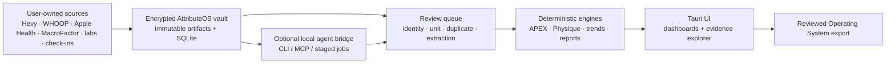

# AttributeOS - Technical Design

## 1. Design objective

Build a Windows-first local application that can ingest heterogeneous health/performance evidence, preserve immutable sources, normalize comparable records, route ambiguity through human review, calculate transparent derived metrics and export only reviewed summaries.

The first production slice is APEX + Physique Tracker. WHOOP, MacroFactor, Apple Health and labs extend the same evidence architecture rather than creating separate subsystems.

Related: [Product Requirements Document](<5. Idea Vault/2. Application/B2C/Active/AttributeOS - Local Health Evidence/PRD.md>) and [Discovery Brief](<AttributeOS - Discovery Brief.md>).

## 2. Design constraints

- Tauri v2 desktop shell; no required web service.
- Rust owns imports, storage, calculations, encryption, reports and agent contracts.
- Svelte 5 + TypeScript is the recommended frontend for alignment with Pernance; the domain boundary does not depend on this choice.
- SQLite is the query store; encrypted source documents live in a content-addressed encrypted blob store.
- Real health exports, laboratory PDFs and photos never enter source control or Build Vault.
- Every accepted derived value must retain input IDs and formula/mapping version.
- Core use must work offline and without an LLM.
- Any agent write produces a staged candidate, never a direct accepted mutation.
- Personal-baseline views take precedence over external benchmarks; no cross-domain composite score is permitted.
- Quantifiable uncertainty propagates into derived ranges; unknown uncertainty produces an explicit non-quantified state.
- Source precedence, model activation, close acceptance, deletion and export are policy-driven, versioned and auditable.

### 2.1 PRD requirement traceability

| PRD family | Technical ownership |
| --- | --- |
| `IMP-*` | Sections 8.2-8.3, 9 and 10; storage, adapters, authority, revision and deletion policies |
| `APX-*` | Sections 8.4-8.5 and 11; comparison identities, benchmark admission and APEX engines |
| `PHY-*` | Sections 8.6 and 12; protocols, check-ins, formulas, uncertainty and photos |
| `HLT-*` | Sections 8.7, 9 and 13; source records, personal baselines, health floors and context |
| `RPT-*` | Sections 14 and 17.5; close snapshots, audience profiles, redaction and Operating System export |
| `AGT-*` | Sections 7.6 and 15; disclosure consent, job packets, audit and staged results |
| `MDL-*` | Sections 8.3, 11-14 and 17.3; model registry, impact preview and unavailable states |
| `SEC-*` | Sections 7 and 18; encrypted lifecycle, side channels, recovery, re-key and destruction |

This table maps requirement families to design ownership. Implementation tickets and tests must reference the individual PRD IDs they satisfy.

## 3. System context



Trust boundary rules:

- Source files cross into AttributeOS only after explicit user selection.
- The frontend receives typed commands/views, not arbitrary filesystem or SQL access.
- Agent jobs receive only allowlisted fields/artifacts for one declared purpose.
- Obsidian receives a reviewed summary, not the production database or source artifacts.

## 4. Recommended technology stack

| Layer | Choice | Reason |
| --- | --- | --- |
| Desktop | Tauri v2 | Small local shell and narrow capabilities |
| Core | Rust stable | Typed import/calculation/security boundary |
| UI | Svelte 5 + TypeScript + Vite | Alignment with Pernance and low-overhead reactive dashboards |
| Styling | Tailwind CSS plus local design tokens | Reproduce compact APEX evidence-console language |
| Database | SQLite with SQLCipher spike | Local relational/query store with encryption-at-rest option |
| SQL access | `rusqlite` or `sqlx` after encryption spike | Prefer explicit queries/migrations; select based on SQLCipher packaging result |
| Blob crypto | XChaCha20-Poly1305 | Per-file authenticated encryption with random nonce |
| Key derivation | Argon2id | Optional passphrase wrapper |
| OS key store | Windows Credential Manager through a maintained keyring crate | Keep vault key outside ordinary files |
| Hashing | SHA-256 | Artifact identity, dedupe and backup verification |
| Serialization | Serde JSON/CSV; streaming XML | Versioned import/export contracts |
| Charts | Lightweight SVG/canvas chart library selected during UI spike | Local rendering; accessible tabular fallback required |
| PDF text | Native text extraction first; OCR adapter second | Preserve page evidence and avoid unnecessary OCR |
| Testing | Rust unit/integration/property tests + Playwright/Tauri UI smoke tests | Calculation correctness and end-to-end confidence |

Do not lock the SQL/encryption crates until a Windows packaging, migration and clean-machine restore spike passes.

## 5. Workspace layout

```text
attributeos/
  Cargo.toml
  crates/
    attribute-core/       domain types, units, evidence and formula registry
    attribute-store/      SQLite, migrations, encrypted blobs, backup/restore
    attribute-import/     adapter contract, detection, parsing, dedupe
    attribute-apex/       movement, exercise, benchmark and progression engines
    attribute-physique/   measurements, FFMI and proportional heuristics
    attribute-health/     wearable, nutrition and laboratory normalization
    attribute-report/     snapshot/report and Operating System exports
    attribute-agent/      CLI packets, result validation and optional MCP
  app/
    src/                  Svelte UI
    src-tauri/            commands, capabilities and app lifecycle
  fixtures/
    sanitized/            synthetic or irreversibly sanitized fixtures only
  schemas/
    agent/
    export/
  docs/
```

No production vault or raw export path may live inside the repository.

## 6. Local vault layout

Default application data directory:

```text
AttributeOS/
  vault.json.enc          vault metadata and KDF parameters
  attributeos.db          encrypted SQLite database
  blobs/
    ab/cd/<sha256>.blob   encrypted immutable source artifact
  cache/
    thumbnails/           encrypted or rebuildable cache
  jobs/
    pending/              encrypted staged agent job manifests
    results/              signed/hashed result packets
  exports/                optional user-selected reviewed exports
  backups/                optional; user may choose another location
```

The database stores artifact metadata and encrypted-blob references. Original file names are encrypted metadata because names can expose sensitive information.

## 7. Security and privacy design

### 7.1 Key hierarchy

1. Generate a random 256-bit vault master key.
2. Store a wrapped copy using Windows Credential Manager.
3. If the user enables a passphrase, derive a wrapping key with Argon2id using per-vault salt and versioned parameters.
4. Derive separate subkeys for database, blob encryption and export/backup authentication using HKDF domain labels.
5. Never log keys, passphrases, unredacted artifact paths or health payloads.

The key design must explicitly document what happens if the OS credential store, passphrase or recovery material is lost. “No recovery” is acceptable only if the user chooses it knowingly.

### 7.2 Source artifacts

- Compute SHA-256 before encryption for content identity.
- Encrypt with a random nonce and authenticated metadata containing artifact ID/schema version.
- Store only the encrypted object at rest.
- Decrypt into memory or a restricted temporary file only when a parser/viewer requires it.
- Securely remove temporary job files on ordinary completion; crash recovery removes expired temp material at next launch.

### 7.3 Tauri permissions

- File picker grants one-time read scope to chosen imports.
- Export picker grants one-time write scope to the chosen destination.
- No arbitrary shell, network or directory-recursive capability in the frontend.
- Network capability disabled in the default build; enabling any remote agent endpoint is a separate configuration and threat-model decision.

### 7.4 Logs

Allowed: event type, adapter ID/version, artifact ID prefix, record counts, duration, error code.

Prohibited: medical values, workout details, names from source documents, paths containing sensitive labels, PDF text, screenshot OCR output and decrypted payloads.

### 7.5 Threat model and Windows side channels

The production threat model covers more than database theft:

| Surface | Control |
| --- | --- |
| Windows Search/indexing | Mark the vault and temporary directories non-indexable where supported; warn if policy application fails |
| Thumbnails/previews | Generate inside the encrypted cache or memory; never rely on Explorer thumbnail generation for protected artifacts |
| Temporary parser/viewer files | Create with restricted ACLs in an app-owned directory, track in a temp manifest, remove on completion and sweep expired files at startup |
| Clipboard | Do not copy sensitive values by default; sensitive copy uses an expiry timer and lock clears app-owned clipboard content when safely identifiable |
| Logs/crash reports | Structured allowlist only; no third-party crash upload or telemetry in the default build |
| Swap/hibernation | Document OS-level residual-memory limitations; minimize plaintext lifetime and lock/zero sensitive buffers where practical |
| EXIF/document metadata | Strip from generated thumbnails and non-private exports; preserve original only inside the encrypted artifact |
| Backups | Authenticated encryption, explicit retention location and stale-backup warning after deletion/re-key operations |

The app does not promise physical secure overwrite on SSDs. Full-vault destruction uses cryptographic erasure of every key wrapper plus best-effort file removal. Partial deletion records which backups may still contain the encrypted artifact.

### 7.6 Remote agent disclosure boundary

Local deterministic processing and local-only agent jobs require no network permission. A job that may transmit decrypted content must pass an explicit disclosure gate containing:

- purpose and destination class/provider
- exact artifacts, fields and date range
- sensitivity labels and redactions
- expiry and local temp location
- expected result schema
- user confirmation recorded before execution

The job receives a separately encrypted, short-lived packet. Completion, cancellation, failure or expiry triggers cleanup. The audit record stores hashes, identifiers and scope, never the sensitive payload itself.

### 7.7 Key lifecycle and data destruction

Supported operations are unlock, lock, backup, restore verification, re-key, scoped deletion and full-vault destruction. The selected recovery mode is stored as a user-confirmed policy. Re-keying creates new wrappers/subkeys and rewrites protected material transactionally with a verified rollback backup; it never exposes an unencrypted vault copy.

## 8. Core domain model

All IDs are UUIDv7 or another sortable non-semantic identifier. Timestamps store UTC plus original timezone/offset metadata when supplied.

### 8.1 Profile and configuration

#### `profiles`

| Field | Type | Notes |
| --- | --- | --- |
| `id` | UUID | Local profile ID |
| `display_name_enc` | encrypted text | Never required in reports |
| `timezone` | text | IANA zone |
| `preferred_mass_unit` | enum | kg/lb |
| `preferred_length_unit` | enum | cm/in |
| `created_at` | timestamp | |

#### `profile_attributes`

Versioned slowly changing facts such as height. Fields include `metric_key`, value/unit, effective interval, evidence type, source record, confidence and acceptance status.

### 8.2 Sources and artifacts

#### `source_systems`

`id`, stable key (`hevy`, `whoop`, `apple_health`, `macrofactor`, `lab`, `manual`), display name, adapter ID and source-definition version.

#### `import_batches`

`id`, source system, state, started/completed time, adapter version, detected schema, user-selected period, counts and failure code.

State machine:

```text
selected -> inspected -> parsed -> needs_review -> accepted
                                -> rejected
accepted -> reprocess_proposed -> accepted_new_version | unchanged
```

#### `source_artifacts`

`id`, batch ID, SHA-256, encrypted original filename, media type, size, encrypted blob key, source-created time, imported time and retention status.

#### `source_records`

Stores stable source record identity/fingerprint, artifact/page/row pointer, raw-record hash, parser version and current normalization status. It does not duplicate a complete unencrypted raw payload.

Source edits and deletions create a new source-record revision or tombstone linked by `supersedes_id`. Accepted normalized records are not overwritten; material changes create review items and invalidate dependent derivations.

### 8.3 Evidence and derivation

#### `observations`

General time-series values:

- `metric_key`
- numeric/text value
- original and canonical unit
- observed start/end and timezone
- source record/system/device
- evidence type
- confidence
- acceptance state
- method/protocol ID
- supersedes/duplicate-of relation

Use dedicated training, check-in and lab tables for domain integrity; emit selected values into `observations` when cross-domain timelines need them.

#### `derivations`

| Field | Purpose |
| --- | --- |
| `id` | Derived-value identity |
| `formula_key` | e.g. `ffmi.raw`, `ffmi.kouri_1995`, `apex.best_set` |
| `formula_version` | Immutable version |
| `parameters_json` | Rep range, lookback, coefficients, target values |
| `input_refs_json` | Accepted input observation/set/check-in IDs |
| `result_json` | Typed result |
| `evidence_type` | calculated/heuristic/benchmark-derived |
| `calculated_at` | Snapshot time |
| `stale_at` | Set when an input changes/supersedes |

Derived results are append-only snapshots. Input changes mark dependent outputs stale; they do not rewrite historical reports.

#### `review_items`

Category, severity, candidate entity, candidate value, evidence pointer, reason code, alternatives, confidence, state, resolution, resolver and timestamps.

#### `model_registry` and `model_versions`

Registers formulas, movement taxonomies, exercise/muscle mapping sets, benchmark packs, baseline policies, uncertainty profiles and selection policies. A version includes immutable content hash, source/citation, assumptions, applicability, confidence, parameters, accepted timestamp and supersedes relation.

Activation is profile-scoped and cannot rewrite accepted outputs. A model-impact job lists affected derivations/reports and produces candidate replacements before the version becomes active.

#### `source_authority_policies`

Versioned policy by profile and metric key containing canonical source, ordered secondary sources, duplicate window/fingerprint rule, conflict tolerance, missing-source behavior and effective interval. The winning observation retains links to every competing source record and the applied policy version.

#### `uncertainty_profiles`

Method/protocol-specific lower/upper bound or repeatability tolerance, unit, provenance, applicability, confidence and version. A method name alone does not imply a numeric range; absent bounds use `uncertainty_not_quantified`.

#### `baseline_policies` and `baseline_snapshots`

Policies define metric, rolling or block window, minimum count, comparability filter, aggregation, missing-data rule, outlier-display rule and stale-after period. Snapshots retain accepted input IDs, result/range, coverage, policy version and generated/accepted state.

#### `health_floor_policies`

Threshold source enum (`source_reported`, `user_defined`, `clinician_accepted`), metric/analyte, range/condition, effective interval, evidence pointer and acceptance state. The schema does not include a product-invented clinical threshold type.

#### `close_cycles`

Period, included modules, expected sources, import batch IDs, unresolved-item policy/counts, model versions, source coverage, draft/accepted/superseded state, report IDs, Operating System export ID and timestamps.

#### `audit_events`

Append-only privacy-safe event metadata for import, acceptance, correction, deletion, model activation, close acceptance, export, backup/restore and agent jobs. Payload values and decrypted paths are prohibited; actors, entity IDs/hashes, policy/model versions and outcome codes are retained.

### 8.4 Training model

#### `training_blocks`

Named block, start/end, intent, phase, notes and acceptance state.

#### `workout_sessions`

Source session ID, start/end, timezone, routine/program day, title, notes, block ID and evidence state.

#### `exercise_identities`

Canonical exercise ID plus name, equipment class, load model, laterality, execution variant, range-of-motion/context notes and active state.

Examples of distinct load models: external load, bodyweight plus load, assisted bodyweight, machine-stack, plate-loaded machine, cable and timed/isometric.

#### `source_exercise_aliases`

Source name + optional equipment/context -> canonical exercise identity, mapping version, confidence and user override.

#### `training_sets`

- session and canonical exercise ID
- source set index/type
- accepted load and unit
- reps, duration, distance and RPE when applicable
- unilateral/bilateral semantics
- warm-up/working/drop/failure classification
- completion and QC state
- source record pointer

Never coerce a non-load exercise into load/reps merely to fit a chart.

### 8.5 APEX reference model

#### `movement_frameworks`

Framework ID, name (`apex-24`), version, description, status and hash.

#### `movement_patterns`

Stable pattern key, framework version, joint/action description, display order and active state. Phase 0 imports the user's actual 24-pattern map; the code must not invent missing patterns.

#### `exercise_pattern_mappings`

Exercise ID, pattern key, contribution type (`primary`, `secondary`, `stabilizer`, `excluded`), numeric weight, mapping source, confidence, effective version and user override.

#### `muscle_groups` and `exercise_muscle_mappings`

Separate movement coverage from body-part stimulus. Direct and indirect weights are versioned and visible.

#### `benchmark_packs`

Name, version, cohort label (`natural_elite`, `enhanced_elite`, `custom`), author/source, conditions, confidence policy, created/accepted time and immutable hash.

#### `benchmark_entries`

Exercise identity, equipment, load model, reps/rep band, load/bodyweight relationship, bodyweight reference, sex/age class if declared, value/unit, source, evidence confidence and notes.

Benchmark packs never assert the user's treatment/drug status.

### 8.6 Physique model

#### `measurement_protocols`

Versioned protocol describing anatomical landmark, side, flexed/relaxed, tape method, repeat count/aggregation, time/fasted/hydration expectations, repeatability tolerance and uncertainty-profile reference.

#### `physique_checkins`

Date/time, profile, protocol set, weight, body-fat value/method/confidence, source artifact references, context and acceptance state.

#### `body_measurements`

Check-in, measurement key, value/unit, side, protocol version, confidence and source evidence.

#### `reference_athletes`

Reference ID/pseudonym, height, condition/date, measurement source, source quality and notes. Public claims are never entered without a citation/condition/confidence.

#### `reference_measurements`

Reference athlete, measurement key/value/unit, protocol if known, source, confidence and contest/off-season/pumped/unknown condition.

#### `progress_photos`

Encrypted artifact reference, check-in, view/pose, capture conditions, camera distance/height, lighting, timing, EXIF handling, sensitivity and optional crop/thumbnail metadata. Public/clinician inclusion defaults to false.

### 8.7 Recovery, nutrition and lab model

#### `wearable_days` / `sleep_episodes` / `activities`

Retain vendor day boundary and canonical UTC/local display. Proprietary scores have vendor definition/version metadata when available.

#### `nutrition_days`

Scale weight, trend weight, energy, macros, targets and expenditure. Each field declares measured, user-entered or vendor-modelled evidence.

#### `lab_panels`

Collection time, received time, laboratory, ordering context if user supplied, fasting state, source artifact and confirmation state.

#### `lab_results`

Analyte identity, original name, result, original unit, source reference range/text, canonical result/unit if conversion is approved, flags, source page/box and confirmation state.

#### `context_events`

Type, start/end, sensitivity, user text, source, acceptance and export-default. Sensitive treatment context defaults to excluded from reports and agent packets.

## 9. Units and identity

### 9.1 Unit registry

The core owns a versioned unit registry for mass, length, time, energy and approved lab dimensions. Each converter specifies:

- dimension
- exact conversion factor where valid
- display precision
- safe/unsafe context rules
- version

Unknown or context-dependent lab units create a review item. The app must never guess molar/mass conversions without molecular/analyte-specific rules.

### 9.2 Metric registry

Each `metric_key` defines domain, display name, dimension, evidence types allowed, expected cadence, stale-after policy, aggregation rules, default baseline policy and source-authority policy.

Initial authority proposals are configuration, not hard-coded truth:

| Metric family | Proposed canonical source | Secondary role |
| --- | --- | --- |
| Resistance sessions/sets | Hevy | Apple Health/WHOOP corroboration or duplicate detection |
| Scale weight and nutrition | User-selected MacroFactor/scale record | Apple Health corroboration |
| WHOOP-native recovery/sleep scores | WHOOP | Apple Health separate raw/source metrics |
| General Apple Health measures | Per-metric selected device/source | Competing devices preserved for review |
| Laboratory result | Original laboratory report | Manual correction as a superseding reviewed normalization |

The profile must confirm each rule when a second overlapping connector is enabled. If the canonical source is absent or stale, the policy chooses `unavailable`, labelled fallback or review; it never silently promotes a secondary source.

### 9.3 Exercise identity

Exercise comparison key:

```text
canonical exercise
+ equipment/load model
+ execution variant
+ laterality
+ relevant assistance/bodyweight semantics
```

Name similarity may suggest an alias but cannot automatically merge identities above the configured confidence threshold.

## 10. Import architecture

### 10.1 Adapter contract

```rust
trait SourceAdapter {
    fn adapter_id(&self) -> &'static str;
    fn adapter_version(&self) -> Version;
    fn detect(&self, artifact: &ArtifactProbe) -> DetectionResult;
    fn inspect(&self, artifact: &DecryptedArtifact) -> Result<Inspection>;
    fn parse(&self, artifact: &DecryptedArtifact, ctx: &ImportContext)
        -> Result<CandidateBatch>;
    fn validate(&self, batch: &CandidateBatch) -> ValidationReport;
}
```

Adapters emit candidates plus warnings; they do not write accepted domain records directly.

### 10.2 Import pipeline

```text
file selection
  -> content hash and encrypted artifact
  -> adapter detection
  -> schema/period/person/timezone inspection
  -> streaming parse into candidates
  -> structural validation
  -> identity/unit/timezone/dedupe rules
  -> review queue
  -> transactional acceptance
  -> affected-derivation invalidation/rebuild
  -> import summary
```

### 10.3 Idempotency and deduplication

Priority:

1. Artifact hash: exact file reimport.
2. Stable source record ID where present.
3. Source-specific deterministic fingerprint.
4. Probable duplicate rule requiring review.

Records are not destroyed during dedupe. Duplicate/superseded relations preserve provenance and allow rule changes later.

After source-local dedupe, a cross-source reconciliation pass evaluates the metric's authority policy. It creates typed links:

- `exact_duplicate`
- `probable_duplicate`
- `corroborates`
- `conflicts`
- `supersedes`
- `independent`

Only the policy-selected record enters the canonical dashboard aggregate. All linked records remain inspectable, and a conflict outside the configured tolerance blocks close acceptance for that metric unless the user explicitly accepts an unresolved exception.

### 10.4 Source revisions and re-import

A later export may contain edited or deleted source records. The adapter compares stable IDs/fingerprints and raw-record hashes against the last accepted source revision:

1. unchanged records are skipped
2. new records become candidates
3. edited records create superseding candidates and dependent-impact preview
4. missing records are not assumed deleted unless the adapter can establish a complete authoritative export window
5. explicit source deletions create tombstone candidates

Accepted corrections invalidate dependent current snapshots but preserve the original accepted derivations and reports. Rebuilding produces new versions.

### 10.5 Screenshot extraction

Screenshot import is intentionally separate from the canonical Hevy adapter:

1. Store encrypted image artifact.
2. Run local OCR or an explicitly approved agent job.
3. Return field candidates with bounding box/page coordinates and confidence.
4. Display image and extracted values side by side.
5. User confirms session identity, set index, load, reps and RPE.
6. Conflict with a later CSV creates a resolution item; no silent overwrite.

### 10.6 Source-specific notes

#### Hevy

- Lock fields only after inspecting the representative export.
- Preserve workout timestamp, exercise name, set ordering and notes.
- Handle warm-up, normal, drop, failure and other set types without assuming current column names.
- Store original exercise name even after canonical mapping.

#### WHOOP

- Treat the export as a bundle of named CSV tables.
- Join records only through documented/stable IDs or explicit time rules.
- Preserve WHOOP day boundary and proprietary score labels.
- Journal entries are user-reported behaviors, not measured physiology.

#### MacroFactor

- Support quick and selected granular spreadsheet shapes through separate schema detectors.
- Keep scale weight, trend weight and expenditure estimate distinct.
- Nutrition targets are plans; intake values are records; expenditure is vendor-modelled.

#### Apple Health

- Stream parse the XML archive.
- Retain type, source name/version, device, unit, creation/start/end times and source metadata.
- Configure source-priority rules by metric but retain all competing records.
- Large imports must be resumable/checkpointed.

#### Laboratory documents

- Text extraction first; OCR only if needed.
- Candidate contains source page and bounding/text evidence.
- Analyte, result, unit, range and collection time require confirmation.
- No derived health interpretation enters the accepted lab record.

## 11. APEX analysis engine

### 11.1 Comparable-set filter

Inputs:

- exercise comparison identity
- accepted working-set classification
- rep range
- date/block window
- optional RPE bounds
- optional bodyweight at session
- selection policy version

Output: selected source set IDs plus exclusion reasons.

The detail view must expose included and excluded sets.

### 11.2 Best-set policies

Initial policy:

```text
observed_5_8_load_primary/v1
  accept working sets with reps 5..8
  require comparable exercise/equipment/execution identity
  rank by external load
  then reps
  then recency
  retain RPE and failure flags as context
```

Bodyweight and assisted movements require load-model-specific ranking. Do not rank an assisted movement using raw external load as if more assistance were better.

### 11.3 Benchmark calculation

Benchmark entry selection requires exact/approved exercise identity, equipment/load model and rep policy. Bodyweight calibration is a benchmark-pack strategy, not a hidden global rule.

Result:

```json
{
  "current": { "value": 0, "unit": "kg", "source_set_id": "" },
  "benchmark": { "value": 0, "pack_id": "", "entry_id": "" },
  "gap_absolute": 0,
  "gap_percent": 0,
  "comparability": "exact | mapped | weak | unavailable",
  "warnings": []
}
```

### 11.4 Coverage

For each APEX-24 pattern, aggregate accepted mappings in the configured current-program or lookback window.

States:

- `covered_direct`
- `covered_indirect`
- `deliberately_excluded`
- `missing`
- `ambiguous`
- `no_recent_data`

Coverage thresholds are configuration/version data and shown in the report.

### 11.5 Body-part score

The body-part engine combines exercise exposure using explicit direct/indirect weights. It should initially output a descriptive stimulus/coverage rating, not claim muscle growth.

The APEX reference labels can be represented as a configurable display scale such as underdeveloped/moderate/strong/elite, but each label must declare whether it is based on coverage, performance benchmark or both.

### 11.6 Progress

- Session best and weekly best.
- Week-over-week and block-over-block delta.
- Optional rolling median for noisy exercises.
- Form reset, equipment change and mapping change split the comparison series unless explicitly bridged.

### 11.7 Day-level analysis

Group comparable exercise exposures by program-day identity and sequence position. Compute count, median/best, spread and trend. A flag needs:

- minimum observation count per compared day
- same comparison identity and selection policy
- no unresolved QC conflicts
- context/warnings listed

The result is a candidate program-sequencing observation, not physiological causation.

### 11.8 Benchmark-pack validation

A benchmark pack cannot move from draft to active unless its schema validates:

- entry source/citation and permitted usage/licensing note
- exact or approved exercise identity and equipment/load model
- ROM/execution, grip/stance/laterality and assistance/bodyweight semantics where material
- observed rep band or estimated-1RM formula and supported input range
- cohort label plus sex, age, weight/bodyweight calibration and training status when claimed
- source date, confidence and known limitations

Entries with missing applicability are viewable as research notes but cannot calculate a gap. Natural/enhanced cohort labels are never joined to a profile treatment-status field.

### 11.9 Evidence hierarchy and stimulus limits

APEX produces independent view models for personal progress, bodyweight-relative performance, movement coverage and external benchmarks in that order. No external benchmark can lower a personal-progress value or override a coverage state.

Direct/indirect muscle weights are configuration in a versioned mapping set. The output is named `configured_exposure_score`, carries the contributing exercises/weights and cannot use growth/deficit language unless a separately governed model supports that claim. Phase 1 does not include such a model.

## 12. Physique calculation engine

### 12.1 Formula registry

```text
ffm/basic/v1
  FFM = weight_kg * (1 - bf_percent / 100)

ffmi/raw/v1
  FFMI = FFM / height_m^2

ffmi/kouri_1995/v1
  normalized = raw_ffmi + 6.3 * (1.80 - height_m)
```

Calculators reject missing/non-accepted inputs and body-fat values outside configured validation ranges. They propagate input confidence and body-fat method into result metadata.

### 12.2 Target inversion

Use the equations in the PRD to solve target FFM and target weight. Store user target separately from the derived result. A target edit marks previous projections stale but does not rewrite old reports.

### 12.3 Measurement deltas

Comparable only if measurement key, side, posture/flex state and protocol version match or an explicit bridge says they are comparable. Weakly comparable deltas remain visible with a warning.

### 12.4 Reference scaling

```text
physique/linear_height_scale/v1
scaled = reference_value * user_height / reference_height
```

The combined target is a confidence-weighted mean only when references share compatible measurement conditions. Otherwise show references separately.

### 12.5 Waist projection

`personal_regression/v1` requires at least three same-protocol accepted check-ins spanning a configurable body-fat range. The model returns fit diagnostics and prediction interval; poor fit returns unavailable.

`legacy_0_35in_per_bf_point/v1` is disabled by default, has evidence type `heuristic` and displays low confidence. The coefficient is stored as a parameter rather than hardcoded into UI logic.

### 12.6 Uncertainty propagation and sensitivity

The calculation boundary accepts point inputs plus optional intervals:

```rust
struct UncertainQuantity {
    point: Decimal,
    lower: Option<Decimal>,
    upper: Option<Decimal>,
    unit: UnitId,
    profile_version: Option<ModelVersionId>,
    state: UncertaintyState,
}
```

For monotonic Phase 1 formulas, evaluate accepted bound combinations deterministically to produce conservative output intervals. Preserve the point result, lower/upper result, input bounds and dominant-input sensitivity. Do not invent method-based bounds in code; they come from an accepted uncertainty profile or explicit measurement range.

Circumference change is classified as `increase`, `decrease`, `inconclusive_within_tolerance`, `weakly_comparable` or `unavailable`. If inputs lack quantified uncertainty, the UI displays the point estimate with `uncertainty_not_quantified`, not a fabricated interval.

### 12.7 Photo protocol and privacy

The check-in workflow can enforce a versioned photo set: front/side/back pose, camera height/distance, focal-length/device note, lighting/background, time relative to food/training, crop and clothing. Generated derivatives strip EXIF and remain encrypted. An export must opt each image in; public and clinician report profiles exclude photos by default.

## 13. Cross-domain timeline and associations

The timeline reads accepted observations and context events into aligned local-day views. It does not mutate source records.

### 13.1 Personal baseline engine

Baseline policies support `rolling_window` and `training_block` modes. A calculation requires comparable accepted observations, the policy's minimum count and coverage, and no unresolved authority conflict. It returns central tendency, spread/range, source coverage, stale date and input IDs.

Default windows such as 28 or 90 days are profile configuration to be confirmed during Phase 0, not universal health rules. Views label comparisons as `vs_personal_baseline`, `vs_source_reference` or `vs_external_benchmark`; these types cannot be merged into one status.

### 13.2 Context and confounders

Context events include illness, injury, travel, sleep/schedule disruption, training phase, deload, calorie phase, equipment/gym change, exercise form reset, program change, bodyweight change and user-defined interventions. They split comparison series when the governing policy says conditions are no longer comparable.

An intervention/event registry is descriptive. It may answer what preceded, followed or coincided with a change and may generate questions, but it does not estimate treatment effects or claim causality.

### 13.3 Descriptive associations

Optional descriptive association jobs must declare:

- selected variables
- date range
- missing-data policy
- aggregation method
- lag window
- sample count
- result uncertainty
- “association, not causation” label

No association result may automatically change a health, training, nutrition or treatment plan.

## 14. Reports and snapshots

### 14.1 Report types

- Baseline evidence report.
- Weekly training/recovery summary.
- APEX training-block review.
- Physique check-in report.
- Lab trend and clinician-question brief.
- Operating System accepted summary.

### 14.2 Snapshot semantics

A report stores:

- report version/type/period
- accepted input IDs and derivation IDs
- source coverage/freshness
- unresolved review items
- user-selected goals/benchmark packs
- rendered JSON model
- Markdown/HTML render hash
- generated and accepted timestamps

Accepted reports are immutable. Later data changes mark them historically complete but potentially superseded; the UI offers regeneration as a new version.

### 14.3 Close engine

Close state machine:

```text
open -> imports_complete -> review_ready -> draft_generated -> accepted -> exported
                    \-> blocked
accepted -> superseded_by_new_close
```

The close validator checks expected-source coverage, staleness, unresolved authority conflicts, model versions, benchmark applicability, uncertainty state and configured blocking review items. A user may accept a non-blocking exception only with a reason recorded in the close snapshot.

Acceptance transaction writes the immutable close snapshot, report models/hashes and audit event together. File export occurs afterward and records success/failure separately so a failed filesystem write cannot unaccept a close.

### 14.4 Report profiles and redaction

Each report type declares one audience profile:

| Profile | Default posture |
| --- | --- |
| `private_full` | Reviewed selected evidence; sensitive context included only through explicit section choice |
| `clinician_safe` | Dates, methods, trends, source flags, symptoms and user questions; excludes benchmark identity speculation, private notes and photos by default |
| `public_content` | Aggregated/de-identified, minimum necessary and explicitly approved; denies raw labs, treatment/PED context, exact private values, photos and source metadata by default |

Profiles use positive field allowlists followed by a sensitivity-policy check; they are not implemented as a blacklist. The preview shows included and excluded fields, media, date precision and metadata. Snapshot tests assert that forbidden fields cannot render.

### 14.5 Operating System export contract

```json
{
  "schema": "attributeos.operating-system-summary/v1",
  "profile_id": "local-pseudonymous-id",
  "period": { "from": "", "to": "" },
  "generated_at": "",
  "accepted_at": "",
  "source_coverage": [],
  "health_floor_exceptions": [],
  "training_summary": {},
  "physique_summary": {},
  "nutrition_recovery_summary": {},
  "lab_summary": {},
  "unresolved_items": [],
  "formula_versions": [],
  "model_versions": [],
  "baseline_policies": [],
  "source_authority_policies": [],
  "uncertainty_summary": [],
  "close_id": "",
  "excluded_sensitive_context": true
}
```

Markdown is rendered from the same JSON so human and machine exports cannot drift.

## 15. Agent interface

### 15.1 Principle

Agents operate over explicit job packets. The app owns authorization, data minimization, schema validation and acceptance.

### 15.2 CLI

Proposed commands:

```text
attributeos status
attributeos manifest --period <from..to>
attributeos import inspect <file>
attributeos validate [--batch <id>]
attributeos export-agent --job <type> --scope <manifest>
attributeos apply-result <result.json>
attributeos report draft <type> --period <from..to>
attributeos backup create <path>
attributeos backup verify <archive>
attributeos restore verify <archive> --scratch <path>
```

Commands return structured JSON with stable exit codes. Human-readable output is optional.

### 15.3 Job packet

```json
{
  "schema": "attributeos.agent-job/v1",
  "job_id": "",
  "purpose": "screenshot_extract | lab_extract | alias_suggest | coverage_summary | report_draft",
  "created_at": "",
  "expires_at": "",
  "allowed_inputs": [],
  "prohibited_outputs": ["diagnosis", "prescription", "ped_optimization"],
  "result_schema": "",
  "privacy": {
    "local_only": true,
    "destination_class": "local | approved_remote_provider",
    "contains_sensitive_context": false,
    "redaction_profile": "",
    "consent_id": null
  }
}
```

Results failing schema, scope or provenance validation are rejected before entering the review queue.

For a remote destination, `consent_id` is mandatory and resolves to the exact packet hash, disclosed fields/artifacts, provider class and expiry accepted by the user. Consent is not reusable for another packet or purpose. Packets/results are encrypted at rest, use app-owned temporary storage and are purged on completion/expiry according to the job policy.

### 15.4 MCP

MCP is deferred until the CLI contract is stable. Initial tools:

- `attributeos_get_manifest`
- `attributeos_query_accepted_observations`
- `attributeos_list_review_items`
- `attributeos_get_apex_snapshot`
- `attributeos_get_physique_snapshot`
- `attributeos_draft_report`
- `attributeos_submit_candidates`

Read-only tools are enabled by default. `submit_candidates` stages a result and cannot accept it.

## 16. Tauri application boundary

Representative commands:

```text
vault_create
vault_unlock
vault_lock
source_select_and_inspect
import_start
import_status
review_list
review_resolve
apex_get_dashboard
apex_update_mapping_candidate
physique_create_checkin_candidate
physique_get_dashboard
timeline_query
report_generate_candidate
report_accept_and_export
close_create
close_validate
close_accept
model_impact_preview
source_authority_update_candidate
export_preview_redaction
data_delete_preview
data_delete_execute
backup_create
backup_verify
vault_rekey
vault_destroy_preview
```

Commands accept validated DTOs and return narrow view models. Domain crates have no dependency on Tauri.

## 17. Frontend design

### 17.1 Routes

```text
/
/review
/sources
/training
/training/coverage
/training/benchmarks
/training/exercises/:id
/training/blocks/:id
/physique
/physique/checkins/:id
/recovery
/nutrition
/labs
/timeline
/reports
/close
/models
/settings/privacy
/settings/data
/settings/sources
/settings/benchmarks
/settings/mappings
```

### 17.2 State management

- Server-state query layer around Tauri commands.
- Local form state for candidates.
- No duplicate client-side source of accepted records.
- Long imports use event/progress subscriptions and resumable job IDs.
- Lock event clears sensitive UI stores and image object URLs.

### 17.3 Evidence component contract

Every metric component supports:

- value and unit
- evidence-type badge
- source and observed date
- freshness/confidence
- point/range or explicit unquantified/unavailable state
- comparison type: personal baseline, source reference or external benchmark
- source-authority and model-policy versions where applicable
- unresolved warning count
- click-through to inputs/derivation/source pointer

Colour is supplementary; icons/text convey states.

### 17.4 APEX visual language

Adopt the reference's high-contrast black/charcoal surface, restrained blue/green/purple functional accents and compact cards. Preserve clarity by:

- using colour consistently for input/process/output or evidence states
- providing tables behind charts
- avoiding tiny monospace text for required information
- showing formulas and provenance in side panels rather than hiding them in tooltips

### 17.5 Onboarding and recurring review

The first-run state can complete with a vault, one Hevy import and one physique check-in. Missing modules render as not configured/unavailable with the evidence needed to enable them. Review supports bulk acceptance only for identical, previously user-confirmed rules; material values, new alias shapes and authority conflicts remain individually inspectable.

The Close route shows estimated review work, blocking/non-blocking items, expected versus available sources and changes since the prior accepted close. Backup/restore, data export, scoped deletion and vault destruction are first-class settings flows with preview and verification rather than CLI-only operations.

## 18. Backup, restore and migrations

### 18.1 Encrypted backup

Backup contains:

- encrypted database snapshot
- encrypted blobs
- schema/app version manifest
- ordered file hashes and sizes
- key-wrapper metadata but never an unwrapped master key
- authenticated archive manifest

### 18.2 Restore verification

Verification restores into an isolated scratch directory, opens the database, checks migrations, verifies all blob hashes/authentication tags and recalculates selected deterministic report hashes.

Production use is blocked until backup and clean-machine restore are tested.

### 18.3 Database migrations

- Monotonic numbered migrations in source control.
- Backup before destructive migration.
- Migration transaction where SQLite permits.
- No downgrade claim unless tested.
- Formula/mapping updates create new versions, not data-rewriting migrations.

### 18.4 Re-key, retention and deletion

- Re-key executes as a resumable journaled operation with an authenticated pre-operation backup and verification before old wrappers are removed.
- Artifact retention is policy-driven by source/sensitivity; the default is keep immutable source until explicit user deletion, not silent expiry.
- Scoped deletion previews dependent records, derivations, reports, exports and known backups. Accepted reports become redacted/superseded where required rather than containing dangling sensitive references.
- Full-vault destruction requires an explicit typed confirmation, removes all key wrappers first, then performs best-effort file cleanup and records no external audit copy.
- Portable export includes accepted structured records, source pointers/hashes where artifacts are omitted, model/policy versions and reports in documented schemas.

## 19. Performance and reliability targets

- App unlock to dashboard: under 2 seconds for normal local vault after warm start.
- Hevy 5-year export: parse under 10 seconds on target Windows hardware after schema lock.
- Apple Health import: streaming and checkpointed; memory target below 300 MB for large archives.
- Dashboard query: under 200 ms for cached 90-day views.
- Long work never blocks the UI thread.
- Crash during import leaves no partially accepted transaction.
- Reimport after crash resumes or restarts idempotently.
- Lock during import safely cancels or completes encrypted work without exposing temp files.
- Close acceptance is atomic and reproducible from recorded inputs/models; export failure does not corrupt acceptance state.
- A normal recurring close exposes an estimated review count/time and supports idempotent restart.

Targets are provisional until representative file sizes are measured.

## 20. Testing strategy

### 20.1 Calculation tests

- Golden FFMI examples using `6.3` correction.
- Property tests for unit round trips and target inversion.
- Boundary tests for body-fat, height and target inputs.
- Linear reference scaling and weighted-reference tests.
- Waist-projection mode/availability tests.
- APEX best-set selection across equipment, reps, laterality and assistance.
- Interval/sensitivity tests for FFMI and target inversion using explicit input bounds.
- `uncertainty_not_quantified`, inconclusive-tolerance and unavailable-state tests.
- Baseline minimum-count, comparability, missing-data and staleness tests.
- Model-impact tests proving historical accepted report hashes remain unchanged.

### 20.2 Adapter tests

- Synthetic/sanitized golden fixtures per detected schema.
- Duplicate artifact and duplicate record tests.
- Partial line, malformed row, unknown column and timezone tests.
- Apple Health large-stream/checkpoint tests.
- Lab decimal/unit/reference-range adversarial fixtures.
- Screenshot candidate schema and conflict tests.
- Cross-source authority tests for duplicate, corroborating, conflicting, stale-primary and late-correction cases.
- Source revision/tombstone tests proving dependent current snapshots invalidate without rewriting accepted history.

### 20.3 Storage/security tests

- Wrong key/passphrase.
- Tampered blob and backup authentication failure.
- Crash-recovery temp cleanup.
- Sensitive-log snapshot tests.
- Database migration from every released schema.
- Backup/restore with report hash comparison.
- Windows index/temporary/thumbnail/EXIF leakage checks on the packaged build where the OS permits automation.
- Re-key interruption and rollback tests.
- Partial deletion, stale-backup warning and full-vault cryptographic-erasure tests.
- Remote-agent packet scope/expiry/consent and sensitive-audit-payload denial tests.

### 20.4 UI tests

- First-run vault setup.
- Import preview/review/accept loop.
- Evidence click-through.
- APEX coverage and benchmark drilldown.
- Physique check-in and formula drilldown.
- Lock clears sensitive views.
- Keyboard navigation and non-colour status comprehension.
- First-run with only Hevy and one check-in; unavailable modules explain requirements.
- Close blocking, exception acceptance and supersession flow.
- Private/clinician/public redaction previews with forbidden-field snapshot tests.
- Backup/restore, portable export and deletion flows without CLI use.

## 21. Delivery plan

### Phase 0 - Foundation spikes

1. Scaffold Rust workspace and Tauri/Svelte app.
2. Prove Windows key store, database encryption, blob encryption and clean restore.
3. Inspect representative Hevy file and screenshot without committing them.
4. Create sanitized fixtures and adapter schema notes.
5. Import/validate the user's actual APEX-24 framework and one benchmark pack.
6. Implement units, evidence, derivation and review schemas.
7. Lock Phase 1 measurement/photo protocol, uncertainty profiles and personal-baseline policy.
8. Confirm Phase 1 source-authority matrix and close cadence/blocking policy.
9. Test Windows side channels, recovery/no-recovery, re-key, deletion and agent-disclosure controls.

### Phase 1A - Hevy evidence

1. Artifact vault and Hevy adapter.
2. Workout/exercise/set browser.
3. Identity mapping and QC queue.
4. Screenshot candidate extractor interface.
5. Source-revision, cross-source-link and material-correction review flow.

### Phase 1B - APEX

1. APEX-24 mapping/coverage.
2. Best-set policies and benchmark packs.
3. Progress and body-part engine.
4. Day-level descriptive analysis.
5. Block report.
6. Benchmark admission validator, evidence hierarchy and model-impact preview.

### Phase 1C - Physique

1. Protocol-aware check-ins.
2. FFM/FFMI and target calculator.
3. Reference athlete library and heuristic scaling.
4. Waist projection modes.
5. Check-in report.
6. Uncertainty propagation, sensitivity and inconclusive-change states.

### Phase 1D - Trust close

1. Evidence drilldown for every output.
2. Backup/restore test.
3. Period close with source/model/uncertainty validation.
4. Private Operating System export plus clinician/public redaction fixture tests.
5. Portable export, scoped deletion and recovery/re-key UX verification.
6. Phase 1 acceptance run on real data.

Later phases follow the PRD and reuse this foundation.

## 22. Technical risks and mitigations

| Risk | Mitigation |
| --- | --- |
| Source schemas change | Adapter/version detection, golden fixtures and import preview |
| Public athlete benchmarks are unreliable | Source/condition/confidence required; immutable user-selected packs |
| Exercise names hide meaningful equipment differences | Comparison identity and explicit mapping review |
| Screenshot extraction corrupts set values | Bounding/source evidence and mandatory confirmation |
| Body-fat error distorts FFMI | Display method/date/confidence and propagate uncertainty |
| A heuristic looks scientific | Evidence badges, formula provenance and disabled/low-confidence defaults |
| Apple Health duplicate flood | Source/device metadata, source priorities and non-destructive dedupe |
| Lab conversion error | Allowlisted analyte-specific conversion and mandatory QC |
| Local-only data is lost | Encrypted backup plus verified scratch restore |
| Agent leaks sensitive data | Explicit job packets, allowlists, expiry and local-only default |
| Dashboard becomes an autonomous coach | Report/compare/flag only; human acceptance and no treatment/program mutation |
| False precision survives confidence labels | Explicit intervals/tolerances, sensitivity and unavailable/unquantified states |
| External benchmarks dominate self-progress | Fixed evidence hierarchy and independent view models |
| Benchmark cohort/technique is inapplicable | Activation validator plus exact applicability/comparability metadata |
| Overlapping sources double-count evidence | Metric authority policies, typed cross-source links and conflict-blocked close |
| Source edits rewrite history | Source revisions, dependency invalidation and superseding snapshots |
| Model updates move past results silently | Impact preview, immutable accepted reports and explicit activation |
| Windows creates plaintext side channels | App-owned encrypted/restricted cache/temp, index controls and packaged leakage tests |
| Partial deletion creates a false guarantee | Backup inventory warnings and explicit SSD/cryptographic-erasure semantics |
| Public/clinician export leaks private context | Positive field allowlists, sensitivity check and forbidden-field snapshot tests |
| Recurring review becomes burdensome | Close review budget, alias memory, safe bulk actions and measured cycle time |

## 23. Required implementation inputs

- One representative native Hevy export covering the desired 90-day Phase 1 window.
- One or more representative Hevy session screenshots.
- The exact user-defined APEX 24-movement framework.
- At least one complete benchmark pack with sources, equipment and rep assumptions.
- Two dated physique check-ins or one baseline plus a defined second-check-in plan.
- Decision on vault unlock/recovery model.
- User-selected Operating System staging destination for reviewed exports.
- Accepted Phase 1 physique measurement/photo protocol and any defensible repeatability/uncertainty bounds.
- Personal-baseline windows, minimum counts and stale-after thresholds for Phase 1 metrics.
- Confirmed metric source-authority matrix before any overlapping Phase 2/3 connector is enabled.
- Close cadence, blocking-review categories, exception policy and review-time budget.
- Private, clinician-safe and public report field allowlists.
- Raw artifact/photo retention, partial-deletion and backup-retention policy.
- Repository location, application ID, license, signing/update decision and sanitized-fixture procedure.

## 24. Decisions deliberately deferred

- Public/multi-user product architecture.
- Cloud sync and mobile companion.
- Automated coaching/program generation.
- Real-time source APIs.
- Cross-user benchmark crowdsourcing.
- Medical decision support.
- Agent access to unredacted sensitive treatment context.
- FHIR or other clinical-system interoperability without a concrete clinician use case.
- Composite health/readiness/optimization scoring.
- AgenticOS/Hermes/multi-agent control-plane integration.
