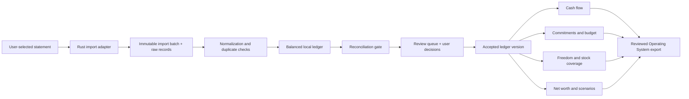

# Pernance Architecture and Data Model

## Architecture goals

- Local-only default with a narrow, inspectable trust boundary.
- Correctness and lineage before dashboard speed.
- Immutable source evidence and reversible interpretation.
- One domain core shared by UI, import tests and future CLI tools.
- No frontend access to arbitrary files, SQL or secrets.
- Derived views can always be rebuilt from accepted ledger facts and assumptions.

## System shape



## Proposed workspace

```text
pernance/
  crates/
    pernance-domain/     money, accounts, journal, rules, calculations
    pernance-import/     adapter contract, CSV, PDF, fingerprints
    pernance-store/      SQLite, migrations, encryption, backups
    pernance-report/     close snapshots, cashflow, freedom, net worth
    pernance-cli/        fixture/debug tools with no production secrets
  app/
    src-tauri/           Tauri commands, capabilities, app lifecycle
    src/                 TypeScript UI
  fixtures/              synthetic/anonymized test statements only
  docs/
```

The exact repository path and frontend framework are not locked by the PRD.

## Tauri trust boundary

### Rust core owns

- File selection result validation and bounded reads.
- Password-protected statement handling.
- Parsing, normalization, matching and duplicate detection.
- All database reads/writes.
- Ledger invariants and calculations.
- Encryption key lifecycle and backup/restore.
- Export construction and audit logging.

### WebView owns

- Rendering and interaction.
- In-memory form state that does not contain unlock keys.
- Typed requests to narrow Tauri commands.

### Decision

Do not expose a generic SQL execute capability to the WebView. Although Tauri provides an official SQL plugin, Pernance's frontend needs domain commands such as `preview_import`, `confirm_transfer` and `close_period`, not arbitrary queries. Rust should use a local SQLite library directly behind typed commands.

Tauri capabilities should permit only the main bundled window, explicitly registered commands, user-selected statement files and the app's own data directory. Remote content and network access remain disabled.

## Storage layers

### 1. Source evidence

- File fingerprint and metadata.
- Optional encrypted original file.
- Parser name/version.
- Raw rows or page/line references and original text.
- Never edited after import.

### 2. Interpretation layer

- Normalized dates, amounts, descriptions and account mapping.
- Duplicate candidates, transfer candidates and parse warnings.
- User decisions and rule applications.
- Reversible; never overwrites source evidence.

### 3. Accepted ledger

- Balanced journal events and postings.
- Reconciliation events and accepted period closes.
- Versioned corrections/supersession rather than silent history mutation.

### 4. Derived evidence

- Cash-flow snapshots.
- Recurring-series/commitment projections.
- Budget snapshots.
- Freedom/runway calculations.
- Stock-coverage schedules.
- Net-worth and scenario snapshots.

Derived evidence stores its ledger version and assumption-set version and can be rebuilt.

## Money and ledger invariants

1. Money uses integer minor units plus ISO-style currency code; never floating point.
2. Every posted journal event balances by currency.
3. Imported source values never change.
4. Internal transfers net to zero across included accounts.
5. A credit-card payment is not a second expense.
6. Opening/closing reconciliation never uses an unlabelled fake expense.
7. Closed-period reports identify the exact ledger revision.
8. Business-restricted and personal cash never merge without an explicit transfer/owner-draw event.
9. Stock coverage never increases liquid assets.
10. Stale or unresolved inputs propagate a warning into affected reports.

## Journal examples

| Event | Debit | Credit |
| --- | --- | --- |
| Salary received | Cash/bank asset | Income |
| Card purchase | Expense/consumption | Credit-card liability |
| Card payment | Credit-card liability | Cash/bank asset |
| Cash expense | Expense/consumption | Cash/bank asset |
| Internal transfer | Destination cash asset | Source cash asset |
| Loan payment | Liability principal + interest expense | Cash/bank asset |
| Investment purchase | Investment asset + fees | Cash/bank asset |
| Stocked consumption purchase | Consumption-stock asset | Cash/bank asset |
| Stock consumption | Economic-consumption expense | Consumption-stock asset |
| Opening balance | Account asset/liability | Opening-balance equity/control |

Unclassified imports may initially post to a controlled `Unclassified` account. User classification creates a versioned reclassification so the raw imported side remains traceable.

## Core entities

| Entity | Purpose | Important fields |
| --- | --- | --- |
| Vault | Local dataset and configuration | id, base currency, locale, month start, schema version |
| Account | Financial or valuation container | type, currency, ownership, liquidity class, institution label, active dates |
| SourceFile | Imported evidence | hash, filename label, optional encrypted path, retention state |
| ImportBatch | Reversible import unit | account, period, adapter/version, status, row count, totals |
| RawRecord | Immutable parsed source | source locator, original text/fields, signed amount, posted date |
| ImportTemplate | Institution/account mapping | detector, column/page mapping, sign/date rules, parser version |
| JournalEntry | Balanced economic event | effective date, state, source, supersedes, evidence confidence |
| Posting | Amount movement against an account | entry, account, minor units, currency, role |
| TransactionView | User-facing projection | merchant, description, category, ownership, recurrence, notes |
| TransferLink | Matched account movement | source posting, destination posting, match confidence, user status |
| Merchant | Normalized counterparty | display name, aliases, confidence |
| Category | What the money was for | parent, name, active state |
| Tag | Cross-cutting label | name, color |
| Rule | Explainable classification automation | predicates, actions, mode, version, priority |
| Reconciliation | Statement-period proof | opening, closing, activity, discrepancy, source, acceptance |
| PeriodClose | Frozen reporting point | period, ledger revision, unresolved amount, accepted date |
| RecurringSeries | Detected/confirmed cadence | amount model, cadence, confidence, next date |
| Commitment | User-recognized obligation | layer, owner, start/end, notice, funding state, evidence |
| BudgetProfile | Scenario budget | survival/maintenance/independence/custom, version |
| BudgetLine | Planned amount | category/dimension, period, amount model |
| IncomeSource | Reliability-aware income | amount, cadence, reliability, start/end, scenario inclusion |
| InventoryItem | Consumption-stock commitment | quantity, unit, burn/cadence, price, shelf life, as-of |
| Valuation | Dated asset/liability value | amount, method, source date, confidence |
| Scenario | Non-canonical assumption set | base close, changed assumptions, status |
| Insight | Evidence-backed observation | kind, supporting records, confidence, dismissed state |
| Experiment | User-owned behavior test | hypothesis, period, target signal, result |
| AuditEvent | Durable action history | actor, action, object, before/after refs, timestamp |

## Import adapter contract

Each adapter implements:

```text
detect(file_bytes, filename) -> confidence
inspect(file_bytes, optional_password) -> statement_metadata + warnings
parse(file_bytes, config) -> raw_records + parse_report
validate(raw_records, statement_metadata) -> invariants + warnings
fingerprint(raw_record) -> stable source identity
```

`statement_metadata` should include institution, account suffix if available, currency, period, opening/closing balances and debit/credit totals.

### Adapter requirements

- Parser version is stored on every import.
- Golden fixture tests cover positive/negative signs, dates, multi-line descriptions and page boundaries.
- A parser upgrade does not silently rewrite accepted batches; it offers an explicit reparse comparison.
- OCR-derived fields carry lower confidence and page bounding-box evidence where possible.
- Passwords remain memory-only and are zeroized where practical.

## Duplicate and overlap strategy

Use several identities rather than one fragile hash:

- File SHA-256 blocks exact re-import.
- Raw-row fingerprint catches repeated rows from overlapping statements.
- Normalized candidate fingerprint uses account, date, amount, direction and normalized description.
- Transfer matching is a separate relation and must not delete either source record.
- User can mark legitimate repeated transactions as distinct; that decision becomes a remembered exception.

## Reconciliation engine

For an account period:

```text
calculated_close = opening_balance + sum(signed account postings)
discrepancy = stated_close - calculated_close
```

Reconciliation status:

- `unavailable`: insufficient balance evidence.
- `open`: records still changing.
- `balanced`: discrepancy equals zero within currency precision.
- `accepted_exception`: user accepted a documented discrepancy.
- `stale`: underlying ledger changed after acceptance.

Reports always display reconciliation coverage across included accounts.

## Classification and rules

Rules are ordered, versioned and explainable. A rule result contains:

- Which predicate matched.
- Which fields it proposes or changes.
- Confidence and prior examples.
- Whether review is required.
- Rule version and rollback reference.

Material transfers, business ownership, debt splits and account-balance corrections always require confirmation until a narrowly defined rule has been explicitly approved.

## Calculation engine

Pure domain functions accept an accepted ledger snapshot plus versioned assumptions and return typed reports. They do not query UI state or mutate the ledger.

Key report families:

- Sources and uses of cash.
- Economic recurring burn.
- Income reliability and concentration.
- Commitments and sinking funds.
- Budget actual/variance/forecast.
- Liquid runway and freedom targets.
- Inventory coverage and future cash schedule.
- Net worth and liquidity-class bridge.
- Scenario delta.

Property/invariant tests should cover transfer neutrality, balanced journals, close reproducibility, stock-not-liquid, and report totals matching ledger postings.

## Encryption and key-management spike

No implementation is accepted until this spike proves:

1. Database contents are unreadable at rest without the vault key.
2. Retained statements and exports are encrypted independently or inside an encrypted archive.
3. Key material is not stored beside ciphertext in plaintext.
4. Unlock, lock, timeout and backup/restore work after app restart and OS reboot.
5. Failed unlocks do not corrupt the vault.
6. A lost key has an explicit, tested recovery/no-recovery story.

Working option:

- SQLCipher-compatible encrypted SQLite or an equivalent proven encrypted storage layer.
- Random vault key protected by an OS-bound secret store or Tauri Stronghold, optionally wrapped by a user passphrase derived with a memory-hard KDF.
- Original statements encrypted with a per-vault data key.

This is a hypothesis to test, not a locked library decision. Stronghold protects secrets; it does not automatically encrypt the SQLite database or arbitrary statement files.

## Backups and portability

- Export one versioned encrypted `.pernance` archive.
- Archive contains database, retained source evidence, schema version and integrity manifest.
- Restore verifies hashes and migrations before replacing the active vault.
- Restore is tested on a clean app profile.
- No unencrypted auto-backup to cloud-synced folders by default.
- User may choose a local/removable backup location after a privacy warning.

## Operating System export boundary

The export builder receives one accepted period close and an allowlist of fields. It never reads arbitrary Markdown or writes without a user-selected destination and preview.

Suggested export identifiers:

- Pernance vault ID.
- Period close ID and ledger revision.
- Report generation timestamp.
- Reconciliation coverage and unresolved amount.
- Hash of the exported summary.

This makes the Operating System summary auditable without copying the raw financial ledger.

## Testing strategy

- Synthetic/anonymized fixtures only in source control.
- Golden parser tests for every supported institution/format.
- Property tests for balanced postings and report invariants.
- Import same file twice test.
- Overlapping-period test.
- Transfer/card-payment double-count test.
- Reopen-closed-period stale-report test.
- Migration rollback/restore test.
- Network-disabled end-to-end test.
- Capability test proving frontend cannot read an arbitrary home-directory file.
- Log scan proving raw descriptions/account data are absent.

## Primary technical references

- Tauri process model: https://v2.tauri.app/concept/process-model/
- Tauri security/capabilities: https://v2.tauri.app/security/capabilities/
- Tauri Stronghold: https://v2.tauri.app/plugin/stronghold/
- Tauri SQL/migrations reference: https://v2.tauri.app/plugin/sql/
