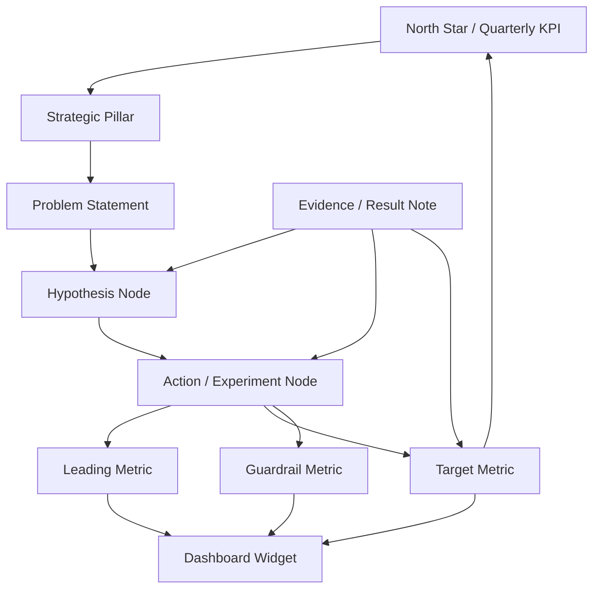
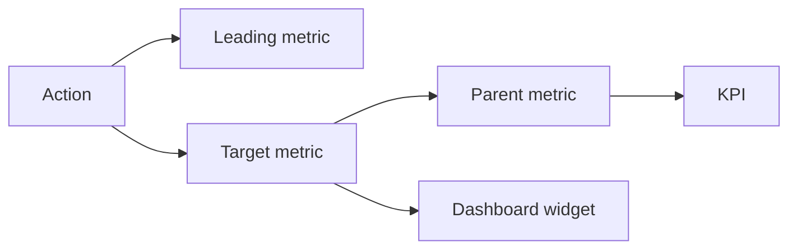

# Strategy Impact and Dashboard Trace - Design

Design doc for making **Strategy** measurable: Action and Hypothesis nodes should connect directly to dashboard metrics and show the straight-line path from **work -> expected impact -> measured outcome -> KPI**.

This extends the current [Strategy - Kanban for Actions and Hypotheses](../5.%20Current%20State%20%282026-07%29/2.%20Strategy%20%28Kanban%20for%20Actions%20and%20Hypotheses%29.md), [Object Model - Workspace, Space, Canvas, Catalog](../5.%20Current%20State%20%282026-07%29/1.%20Object%20Model%20-%20Workspace,%20Space,%20Catalog.md), [Canvas Value Time-Travel](../5.%20Current%20State%20%282026-07%29/5.%20Canvas%20Value%20Time-Travel.md), and [Alerting and Monitoring](../5.%20Current%20State%20%282026-07%29/4.%20Alerting%20and%20Monitoring.md).

## Why

The Strategy page currently turns Action and Hypothesis nodes into a board/table workflow. That is useful, but it can still become ordinary task management: status, due date, assignee, comments.

The next unlock is to make every strategic item carry an **impact contract**:

- What metric is this action meant to move?
- Through which leading metric?
- What is the expected delta?
- What is the baseline?
- When do we measure?
- What guardrail must not get worse?
- Did it win, lose, or stay inconclusive?

The product should make a user see the line:

`Action -> Leading Metric -> Target Metric -> KPI -> Dashboard`

That is the Metrimap-native version of a Strategy Tree.

## Product principle

Strategy is not a task board. Strategy is the **operating layer between the metric tree and the dashboard**.

| Surface | Job |
| --- | --- |
| Canvas | Model how the business works |
| Dashboard | Monitor what is happening |
| Strategy | Decide what to change and prove whether it worked |
| Evidence | Explain why we believe it and what happened |

## Concept model



## Impact contract

Every Action/Hypothesis can optionally become a **measurable bet** by adding:

| Field | Meaning |
| --- | --- |
| Target metric | The metric expected to move |
| Leading metric | Early signal that the action is working |
| Guardrail metrics | Metrics that should not degrade |
| Expected direction | Increase, decrease, stabilize |
| Expected delta | Numeric target, e.g. `+5% checkout conversion` |
| Baseline period | Pre-action period used as comparison |
| Measurement window | Period after launch/run |
| Confidence | Low, medium, high |
| Impact status | Draft, planned, measuring, won, lost, inconclusive |
| Owner | Person accountable for the bet |
| Result note | Summary of what happened |
| Evidence links | Experiments, screenshots, notebooks, customer feedback |

This should work for both:

- **Hypotheses**: "If we do X, Y metric should move because Z."
- **Actions**: "We are doing X to move Y metric by Z in this window."

## Relationship types

Strategy needs typed links to metrics and dashboard widgets, not just generic edges.

| Relationship | From | To | Meaning |
| --- | --- | --- | --- |
| `targets` | Action/Hypothesis | Metric | The primary metric this bet should move |
| `leads_to` | Action/Hypothesis | Leading metric | Early signal |
| `guards` | Action/Hypothesis | Guardrail metric | Must not worsen |
| `supports` | Hypothesis | Action | Action implements the hypothesis |
| `explains` | Evidence | Action/Hypothesis/Metric | Evidence explains the bet or result |
| `shown_on` | Metric | Dashboard widget | Where the metric is monitored |
| `rolls_up_to` | Metric | KPI | Metric-tree path to the top objective |

## UX surfaces

### 1. Strategy Impact Panel

On each Action/Hypothesis detail view:

- target metric picker,
- leading metric picker,
- guardrail metric picker,
- expected delta input,
- baseline period selector,
- measurement window selector,
- confidence selector,
- result status,
- result summary,
- linked evidence.

The panel should preview a straight-line impact path:

`Action -> Target Metric -> KPI`

### 2. Strategy Tree View

A new Strategy view beside Board/Table:

```
Quarterly KPI
  Strategic Pillar
    Problem Statement
      Hypothesis
        Action
          Leading Metric
          Target Metric
          Guardrail Metric
```

This is inspired by the Strategy Tree pattern, but adapted to Metrimap: the bottom layer connects to tracked metrics and dashboards, not just ideas.

### 3. Dashboard Impact Overlay

Dashboard metric widgets should show linked strategy work:

- active bets,
- expected impact,
- measurement window,
- owner,
- current delta vs baseline,
- status: planned / measuring / won / lost / inconclusive.

Clicking the badge opens the linked Strategy items.

### 4. Impact Trace View

For any Action/Hypothesis, show the path:



This answers: "Why are we doing this and where should I see it move?"

### 5. Impact Review Mode

When the measurement window ends:

- compare target metric against baseline,
- compare leading metrics,
- check guardrails,
- summarize result,
- prompt user to mark won/lost/inconclusive,
- create/update evidence note,
- keep the result attached to the metric tree.

## Measurement behavior

### Baseline

Baseline should come from the tracked metric snapshot store whenever possible. For exploratory metrics, allow manual baseline but mark it as manual.

### Measurement window

Use the action's run window or explicit measurement window. A launched action might run from July 1 to July 7, but measurement could be July 8 to July 21.

### Delta

Show:

- baseline value,
- current/window value,
- absolute delta,
- percentage delta,
- expected delta,
- whether result met expectation.

### Guardrails

Guardrail metrics must show pass/fail/unknown. A bet should not be "won" if a critical guardrail fails unless the user explicitly overrides with a result note.

## Data model additions

Recommended new concepts:

- `strategy_impact_contracts`
- `strategy_metric_links`
- `strategy_measurement_windows`
- `strategy_impact_results`
- optional `dashboard_strategy_links`

Possible fields:

```json
{
  "strategy_node_id": "node_action_123",
  "target_metric_id": "metric_checkout_cvr",
  "leading_metric_ids": ["metric_cart_to_checkout_click"],
  "guardrail_metric_ids": ["metric_aov", "metric_refund_rate"],
  "expected_direction": "increase",
  "expected_delta_value": 5,
  "expected_delta_unit": "percent",
  "baseline_period": {
    "start": "2026-07-01",
    "end": "2026-07-14"
  },
  "measurement_period": {
    "start": "2026-07-15",
    "end": "2026-07-28"
  },
  "confidence": "medium",
  "impact_status": "measuring"
}
```

## Build order

1. Design spike: lock the contract, relationship types, and scope.
2. Data model: store impact contracts and metric links.
3. Strategy detail panel: edit target/leading/guardrail/expected impact.
4. Strategy table/board columns: expose impact fields for scanning.
5. Metric picker and trace resolver: find the KPI path through the metric tree.
6. Dashboard impact badges: show linked actions/hypotheses on metric widgets.
7. Impact trace view: visual path from action to metric to KPI/dashboard.
8. Measurement engine: baseline/current/guardrail deltas from metric snapshots.
9. Impact review mode: close the loop with won/lost/inconclusive and evidence.
10. Manual QA and seed demo: a sample strategy tree that proves the flow.

## Open questions

- Should strategic pillars and problem statements be first-class nodes, tags, groups, or just a view over existing cards?
- Is Strategy scoped per canvas, per space, or workspace-wide with canvas filters?
- Should a Hypothesis own the impact contract, with Actions as execution children, or can Actions own their own contracts independently?
- Should dashboards auto-create from Strategy Tree limbs, or should existing dashboard widgets only show Strategy links?
- Should Linear Initiatives map into this same model as top-level objectives?

## Non-goals for v1

- No automated causal attribution.
- No statistical significance engine.
- No full experimentation platform.
- No requirement that every action has metrics; exploratory strategy can remain lightweight.
- No dashboard redesign beyond linked impact badges and trace entry points.

## Linear plan

This is tracked in Linear as [Strategy impact - actions to metrics](https://linear.app/canvasm/project/strategy-impact-actions-to-metrics-26d9860124c5), under the [Strategy-to-impact operating layer](https://linear.app/canvasm/initiative/strategy-to-impact-operating-layer-acb9f47772ad) initiative.

Linear design document: [Design: Strategy impact and dashboard trace](https://linear.app/canvasm/document/design-strategy-impact-and-dashboard-trace-21298ae8dd53).

Milestones:

1. Impact contract foundation
2. Strategy UX
3. Dashboard and trace
4. Measurement and review
5. QA and demo

Issues:

- [CVS-166](https://linear.app/canvasm/issue/CVS-166/spike-lock-strategy-impact-contract-relationship-types-and-scope) - [Spike] Lock Strategy impact contract, relationship types, and scope
- [CVS-167](https://linear.app/canvasm/issue/CVS-167/store-strategy-impact-contracts-and-metric-links) - Store Strategy impact contracts and metric links
- [CVS-168](https://linear.app/canvasm/issue/CVS-168/build-impact-trace-resolver-from-strategy-item-to-kpi-and-dashboard) - Build impact trace resolver from Strategy item to KPI and dashboard
- [CVS-169](https://linear.app/canvasm/issue/CVS-169/add-strategy-impact-panel-to-actionhypothesis-detail-view) - Add Strategy Impact panel to Action/Hypothesis detail view
- [CVS-170](https://linear.app/canvasm/issue/CVS-170/expose-impact-fields-in-strategy-boardtable-columns-and-filters) - Expose impact fields in Strategy board/table columns and filters
- [CVS-171](https://linear.app/canvasm/issue/CVS-171/build-strategy-tree-view-kpi-pillar-problem-hypothesis-action-metrics) - Build Strategy Tree view: KPI -> pillar -> problem -> hypothesis -> action -> metrics
- [CVS-172](https://linear.app/canvasm/issue/CVS-172/show-linked-strategy-impact-badges-on-dashboard-metric-widgets) - Show linked Strategy impact badges on dashboard metric widgets
- [CVS-173](https://linear.app/canvasm/issue/CVS-173/build-visual-impact-trace-view-from-actionhypothesis-to-kpidashboard) - Build visual Impact Trace view from action/hypothesis to KPI/dashboard
- [CVS-174](https://linear.app/canvasm/issue/CVS-174/calculate-strategy-impact-deltas-from-baseline-and-measurement-windows) - Calculate Strategy impact deltas from baseline and measurement windows
- [CVS-175](https://linear.app/canvasm/issue/CVS-175/add-impact-review-mode-with-wonlostinconclusive-result-capture) - Add Impact Review mode with won/lost/inconclusive result capture
- [CVS-176](https://linear.app/canvasm/issue/CVS-176/surface-measured-impact-deltas-in-strategy-and-dashboard-overlays) - Surface measured impact deltas in Strategy and Dashboard overlays
- [CVS-177](https://linear.app/canvasm/issue/CVS-177/create-strategy-impact-demo-dataset-and-manual-test-suite) - Create Strategy impact demo dataset and manual test suite

## Issue Quality Review - 2026-07-04

Visible issue set reviewed from the local project doc, not live Linear API.

Overall assessment:

- The project has a strong build spine: spike -> data model -> resolver -> UX -> dashboard -> measurement -> review -> demo.
- The issue titles are scoped tightly enough for agent execution.
- The sequencing is mostly right and avoids turning Strategy into a full experimentation platform.
- The non-goals are correct: no automated causal attribution, no statistical significance engine, no full experiment platform, and no dashboard redesign beyond impact trace entry points.

Meets the analysis standard if each Linear issue includes:

- Problem / signal.
- Expected outcome.
- Scope and non-goals.
- Acceptance criteria.
- Verification plan.
- Dependencies.
- Manual-test child issue when implementation ships.

Important dependency checks:

- `CVS-166` should explicitly lock the scope question: canvas vs space vs workspace, and whether Hypothesis or Action owns the impact contract.
- `CVS-167` should land before any UI issue that edits impact contracts.
- `CVS-168` should define the reusable trace resolver that `CVS-169`, `CVS-172`, `CVS-173`, and `CVS-176` consume.
- `CVS-174` depends on tracked metric snapshots and should define manual-baseline behavior for exploratory metrics.
- `CVS-175` should explicitly create or update an Evidence note/result note, not only store a result enum.
- `CVS-177` should include a full demo flow that proves: Action -> leading metric -> target metric -> KPI -> dashboard -> result evidence.

Potential missing follow-up:

- Evidence/result integration for Strategy Impact: when an impact review is completed, Canvasm should create or link an Evidence Notebook that records baseline, measurement window, result, guardrails, charts/snapshots, decision, and confidence/conviction change.
- External Action reference metadata: if Strategy items can point to third-party automations or AI workflows, keep this as metadata on the Action node. Do not make Strategy Impact responsible for running those workflows.

Suggested extra issue if not already covered:

- "Link Strategy impact reviews to Evidence Notebooks and conviction changes."

Acceptance criteria for that issue:

- A completed impact review can create or attach an Evidence Notebook.
- The notebook includes baseline, measurement window, result, guardrail status, linked metrics, linked Strategy item, and decision.
- The linked metric/relationship can show that this evidence affected confidence or conviction.
- The evidence renders correctly from Strategy, Dashboard, Evidence repository, and the linked node/relationship.

## Related docs

- [Strategy - Kanban for Actions and Hypotheses](../5.%20Current%20State%20%282026-07%29/2.%20Strategy%20%28Kanban%20for%20Actions%20and%20Hypotheses%29.md)
- [Object Model - Workspace, Space, Canvas, Catalog](../5.%20Current%20State%20%282026-07%29/1.%20Object%20Model%20-%20Workspace,%20Space,%20Catalog.md)
- [Canvas Value Time-Travel](../5.%20Current%20State%20%282026-07%29/5.%20Canvas%20Value%20Time-Travel.md)
- [Alerting and Monitoring](../5.%20Current%20State%20%282026-07%29/4.%20Alerting%20and%20Monitoring.md)
