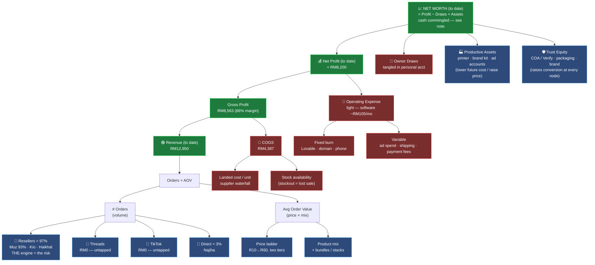

# 🌳 Value Architecture — Driver Tree

> [!abstract] What this is
> The [[Mission & Policies]] charter says *what* we maximise: **net worth that compounds every cycle.** This note decomposes that single outcome down into the **smallest numbers an agent can actually move**, and names the **lever** for each one. When an agent asks "what should I do to grow the business?", the answer is: find the weakest node below, pull its lever. This is the map from *a number on the dashboard* to *an action in the world*.

**How to read it:** each box is a measurable node. A parent equals its children combined (`=`, `×`, `−`). Move a leaf node and the effect ripples up to net worth. The **constraint** is whichever leaf, if improved, moves the top number most for the least effort — find it, fix it, re-evaluate.

---

## The tree



---

## The equation, in one block

```
Net Worth Growth   = Net Profit − Owner Draws
Net Profit         = Gross Profit − Operating Expense
Gross Profit       = Revenue − COGS
Revenue            = (# Orders) × (Average Order Value)
# Orders           = Agents + Threads + TikTok + Website demand
Average Order Value= Price (ladder, correct tier) × Product mix
COGS               = Units sold × (landed cost + pack cost) / unit
Operating Expense  = Fixed burn + Variable (ads + shipping + fees)
```

Two nodes don't show up in this period's profit but **compound everything above** — **Productive Assets** (lower future cost / raise price power) and **Trust Equity** (raise conversion at every channel). Stage 2 of the [[Mission & Policies|ladder]] exists to fund exactly these.

---

## Node → Lever table

Each leaf, the number that lives on it, the **lever** that moves it, and **who pulls it** (pillar → owner). This is the action layer.

### 🟣 Revenue side — *grow the top*

| Node | Current read (real) | Executional lever | Owner |
| --- | --- | --- | --- |
| **# Resellers** | 3 (Muz, Kio, Haikhal) — **Muz = 93% of all revenue** | Recruit to ≥4; repeatable agent offer; grow Kio/Haikhal off the Muz dependency | 🟣 Distribution → Community & Agents |
| **Revenue / reseller** | Now measurable per-customer (orders logged) — Muz 12,030 · Kio 370 · Haikhal 150 | Add `agent:` field so Bases group it automatically; track monthly | 🟠 Data Model |
| **Threads demand** | **RM0 — untapped** | 3–5 research-led posts/week → Verify/COA → WhatsApp close | 🟣 Distribution → Threads |
| **TikTok demand** | **RM0 — untapped** (the old "campaign" was fake data) | Weekly video batch; hand DMs to a reseller | 🟣 Distribution → TikTok |
| **Direct (Najiha-type)** | RM400 (3%) | Verify page → WhatsApp close SOP | 🟣 Distribution |
| **Price (AOV)** | Reta RM400 dropship; public ladder unset; early sales went at RM350 | Complete R10/R20/R30 **public + dropship**; hold ~23% below Olymp | 🟢 Capital → [[Pricing Model]] |
| **Product mix** | Reta = ~95% of revenue | Build Wolverine blends (5 possible); price + sell GHK/CJC; stacks | 🟣 + 🟢 |

### 🔻 Cost side — *keep more of it*

| Node | Current read (real) | Executional lever | Owner |
| --- | --- | --- | --- |
| **Landed cost/unit** | Reta RM133; **66% realised gross margin** | Source down the waterfall **BFF(Reta)→TCI→Uther**; update `#costing` on every PO | 🟠 Operation → Suppliers |
| **Stockout (lost sales)** | **Reta down to 4; GHK-Cu = 0 (sold out)** | Restock Reta now; reorder-point discipline | 🟠 Operation → Restock SOP |
| **Fixed burn** | Light — Lovable RM105/mo (Janoshik COA / domain / phone not yet logged) | Log all recurring costs; cut tools that don't earn | 🟢 Capital |
| **Variable cost** | shipping + payment fees (no ad spend) | Batch shipping; watch fee leakage; keep any future ROAS ≥2.0 | 🟢 + 🟣 |

### 🏭 Compounding nodes — *make every future cycle better*

| Node | Why it compounds | Executional lever | Owner |
| --- | --- | --- | --- |
| **Productive assets** | Permanently lower COGS/opex or raise price power | Stage 2: buy in-house packaging/printer, owned brand kit, ad accounts | 🟢 Capital (funds) → 🟣/🟠 (use) |
| **Trust equity** | Raises conversion at *every* revenue node at once | COA/Verify everywhere; research-grade packaging; consistent brand | 🟣 Distribution → Brand pipeline |

---

## Where the constraint is *right now* (2026-06)

Read the tree against today's reconciled reality. The books are now clean (RM12,950 revenue, RM8,563 gross profit) — so the constraint has moved. In order:

1. **Commingled cash / founder ↔ company (THE constraint now).** Every ringgit sits in the founder's personal account and the founder funded purchases personally — so the business has **no clean cash figure** and can't safely fund its own next cycle. **Settle the founder ↔ company balance and separate a business account** before anything else. → [[Stock & Revenue Reconciliation]] Part D.
2. **Brutal reseller concentration.** **Muz alone is 93% of revenue; resellers are 97%; TikTok/Threads/website are RM0.** If Muz stalls, revenue stalls. Widen the base (recruit, grow Kio/Haikhal) and stand up the dormant channels. This is now the biggest *growth* risk.
3. **Reta is the whole business and it's nearly out.** ~95% of revenue is Retatrutide and the shelf is down to **4 vials**; GHK-Cu is **sold out**. Restock Reta — a stockout here is a near-total revenue stop.
4. **Price ladder incomplete + dead inventory.** R10/R20/R30 unpriced; CJC/SS-31/MOTS-C sitting unsold. AOV and mix upside for low effort.

> [!tip] The agent's standing question
> Each week: *"Which leaf node, if I moved it, adds the most to net-worth growth for the least effort — and am I allowed to (Stage rule, ROAS ≥2, research-use, buffer intact)?"* Pull that lever. Re-check next week — the constraint moves as you fix it.

---

## Related
- 🎯 **[[Mission & Policies]]** — the objective this tree serves + the rules that bound every lever
- 🤖 **[[Agent Operating Manual]]** — the routines that pull these levers
- 📊 **[[KPI Dashboard]]** — live values for these nodes
- 🟣 **[[Distribution — Growth Path]]** (the three engines + the `agent:` instrumentation gap) · 🟢 **[[Capital — Playbook]]** · 🟠 **[[Operation — Playbook]]**
